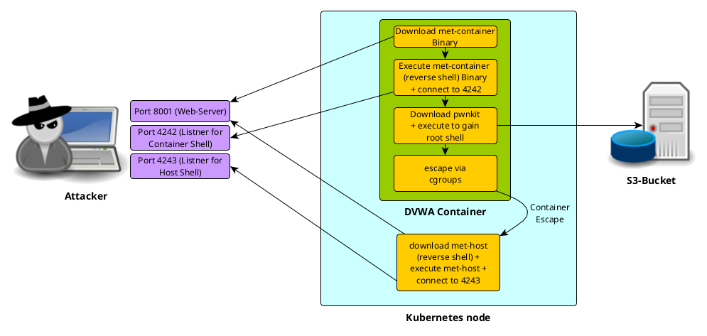

# Container escape in kubernetes

This Repo contains Demo-Hacks for AKS and EKS to have some nice Mondoo demos

- [aws](aws): Terraform template to deploy a eks kubernetes cluster in aws with the dvwa container escape demo
- [azure](azure): Terraform template to deploy a aks kubernetes cluster in azure with the dvwa container escape demo

The hacking-Demo in aks and eks have the following hacking procedure

- hack the web application with a command injection vulnerability
- do a privilege escalation to gain root rights within the container
- do a container escape to get a root shell on the container host

## Contributors + Kudos

* Scott Ford [scottford-io](https://github.com/scottford-io)
* Yvo Vandoorn [yvovandoorn](https://github.com/yvovandoorn)
* Dominik Richter [arlimus](https://github.com/arlimus)
* Christoph Hartmann [chris-rock](https://github.com/chris-rock)
* Patrick Münch [atomic111](https://github.com/atomic111)

Thanks to all of you!!

## License and Author

* Author:: Mondoo Inc

Licensed under the Apache License, Version 2.0 (the "License");
you may not use this file except in compliance with the License.
You may obtain a copy of the License at

    http://www.apache.org/licenses/LICENSE-2.0

Unless required by applicable law or agreed to in writing, software
distributed under the License is distributed on an "AS IS" BASIS,
WITHOUT WARRANTIES OR CONDITIONS OF ANY KIND, either express or implied.
See the License for the specific language governing permissions and
limitations under the License.

## Disclaimer

This or previous program is for Educational purpose ONLY. Do not use it without permission. The usual disclaimer applies, especially the fact that we (Mondoo Inc) is not liable for any damages caused by direct or indirect use of the information or functionality provided by these programs. The author or any Internet provider bears NO responsibility for content or misuse of these programs or any derivatives thereof. By using these programs you accept the fact that any damage (dataloss, system crash, system compromise, etc.) caused by the use of these programs is not Mondoo Inc's responsibility.
