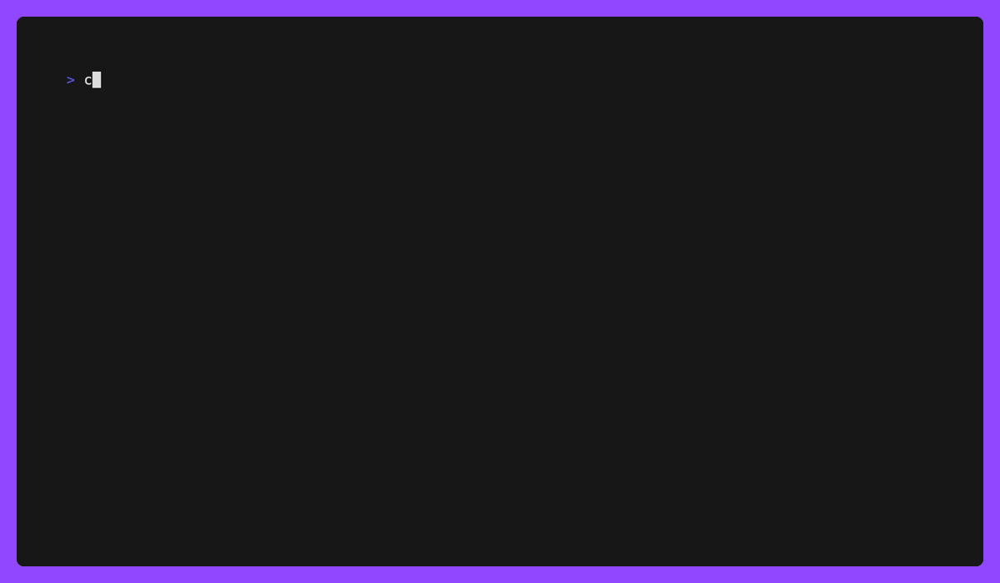

# Security Scanning with cnspec, cnquery, and Mondoo Platform

Welcome to our security scanning repository. Here, you will find various examples and guides on using `cnspec`, `cnquery`, and the Mondoo Platform, for conducting comprehensive security audits on your resources. Our aim is to empower you to maintain the highest standards of security in your technology environments.

## What are cnspec, cnquery, and Mondoo Platform?

`cnspec` is a powerful command-line tool designed for conducting security benchmark tests against various systems, providing insights into potential vulnerabilities and areas of improvement.

`cnquery` is another versatile command-line tool that facilitates advanced querying against your infrastructure data, allowing you to understand and manage your infrastructure more effectively.

The Mondoo Platform is a cloud-native, security and compliance automation platform that enables businesses to secure their infrastructure continuously and at scale.

Together, these provide a comprehensive approach to managing and maintaining the security posture of your systems.

## Examples

In this repository, you will find examples of using `cnspec` and `cnquery` with the Mondoo Platform to conduct security scans and queries on various resources like AWS services, GitHub repositories, and more.

Each example is structured to provide a clear overview, pre-requisites, step-by-step instructions, expected results, and troubleshooting help.

We hope that these examples provide a helpful starting point for your own security scanning needs.

| Platform | Sample                                                                                                                                                                            |
| -------- | --------------------------------------------------------------------------------------------------------------------------------------------------------------------------------- |
| AWS      | [Scanning AWS Account with CIS Amazon Web Services Foundations Benchmark Using cnspec](#aws-scanning-aws-account-with-cis-amazon-web-services-foundations-benchmark-using-cnspec) |
| AWS      | [S3 Bucket Public Exposure Check](#aws-s3-bucket-public-exposure-check)                                                                                                           |
| AWS      | [Checking MFA Status for AWS IAM Users](#aws-checking-mfa-status-for-aws-iam-users)                                                                                               |
| AWS      | [Scan AWS EC2 Instance using cnspec and EC2 Instance Connect](#aws-scan-aws-ec2-instance-using-cnspec-and-ec2-instance-connect)                                                   |
| GitHub   | [Scan the GitHub Organization with CIS GitHub Benchmark Using cnspec](#github-running-the-cis-github-benchmark-with-cnspec)                                                       |

## AWS

### AWS: Scanning AWS Account with CIS Amazon Web Services Foundations Benchmark Using `cnspec`

This guide provides an example on how to execute a CIS Amazon Web Services Foundations Benchmark on your AWS account using the `cnspec`. The CIS (Center for Internet Security) Amazon Web Services Foundations Benchmark provides a set of security configuration best practices for AWS. Performing this benchmark will help ensure that your AWS environment is secure and adheres to the principles of least privilege and defense in depth.

- [Instructions](./aws-account-cis-benchmark/)

### AWS: S3 Bucket Public Exposure Check

This example uses `cnspec` to check for publicly exposed AWS S3 buckets within your AWS account. Publicly exposed buckets can lead to unauthorized access or data breaches, and it's critical to ensure they are secure.

- [Instructions](./aws-public-s3/)

### AWS: Checking MFA Status for AWS IAM Users

This guide demonstrates how to verify that all AWS IAM users have Multi-Factor Authentication (MFA) enabled. Ensuring MFA is crucial in securing your AWS resources as it offers an additional layer of protection by requiring users to provide at least two forms of identification.

- [Instructions](./aws-iam-mfa/)

### AWS: Scan AWS EC2 Instance using cnspec and EC2 Instance Connect

This guide walks you through conducting a security scan on an AWS EC2 instance utilizing `cnspec` and EC2 Instance Connect. EC2 Instance Connect provides a secure and auditable means to connect to your instances, thereby eliminating the necessity to have an open public SSH port.

- [Instructions](./aws-ec2-instance/)

## GitHub

### GitHub: Running the CIS GitHub Benchmark with cnspec

This guide provides an example on how to execute the CIS (Center for Internet Security) GitHub Benchmark on GitHub repositories and organizations using the `cnspec` and Mondoo platform. These benchmarks offer a standardized set of procedures to assess the security posture of GitHub repositories and organizations, helping to identify vulnerabilities or potential areas for security enhancements.

- [Instructions](./github-supply-chain/)

## Contributing

We welcome contributions! Feel free to submit pull requests for new examples or improvements to existing ones. If you encounter any issues or have questions, please open an issue in this repository or join our [Github discussions](https://github.com/orgs/mondoohq/discussions) page. We're here to help!
