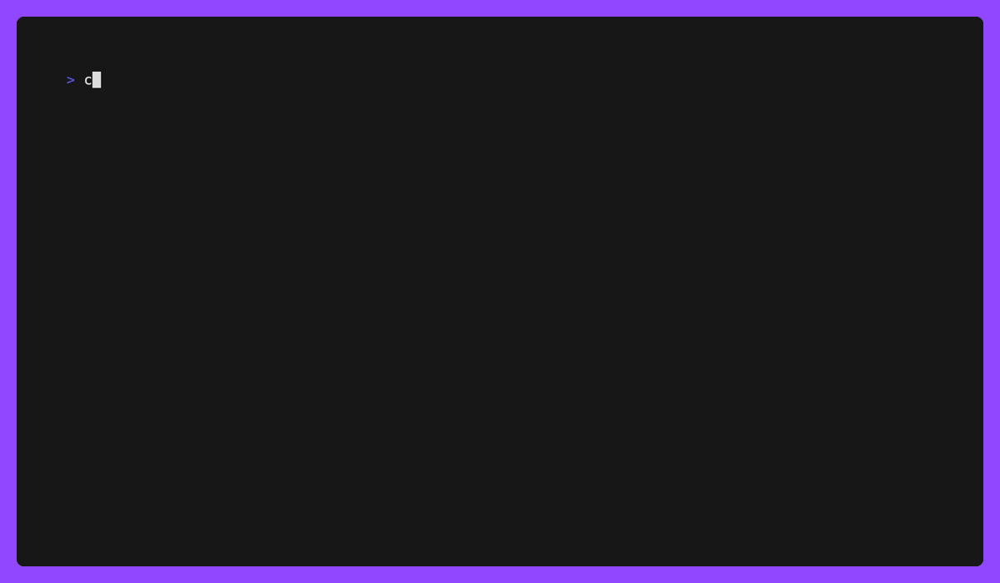

# Scanning an AWS EC2 Instance with cnspec using EC2 Instance Connect

## Overview

This guide walks you through conducting a security scan on an AWS EC2 instance utilizing `cnspec` and EC2 Instance Connect. EC2 Instance Connect provides a secure and auditable means to connect to your instances, thereby eliminating the necessity to have an open public SSH port.

The security scan will be carried out in accordance with:

- Vulnerability Management
- CIS AWS Amazon Linux 2 Benchmark

## Pre-requisites

- You should have the `cnspec` tool installed. You can follow the [installation instructions](https://github.com/mondoohq/cnspec#installation) to set it up.
- You need an AWS account and the necessary permissions to manage EC2 instances.
- The AWS CLI should be installed and configured with your credentials.
- Make sure EC2 Instance Connect is configured for your instance.

## Instructions

To begin, create a new AWS EC2 instance. For this guide, we'll be using Amazon Linux 2. Test the connection to the new instance with the following command:

```bash
aws ec2-instance-connect ssh --instance-id <your-instance-id>
```

Next, perform a security scan on your EC2 instance using `cnspec` and EC2 Instance Connect:

```bash
cnspec scan aws ec2 instance-connect ec2-user@<your-instance-id>
```

This command executes a security scan on your EC2 instance.

## Results

`cnspec` generates a report detailing the vulnerability and security status of the scanned EC2 instance. This report will identify any security vulnerabilities and recommend potential areas for improvement.



## Troubleshoot

- **`cnspec` issues**: Make sure that `cnspec` is installed correctly. If you have trouble running `cnspec`, try updating to the latest version or re-installing the tool.
- **AWS CLI and EC2 Instance Connect**: Ensure the latest AWS CLI is installed and configured correctly. Verify that you are using the correct region, availability zone, and instance ID. If you encounter permission errors, check your AWS IAM role and permissions.
- **SSH connection issues**: If you cannot connect to your EC2 instance, make sure you are using the correct username (usually "ec2-user" for Amazon Linux instances).

For more complex or ongoing issues, feel free to participate in our [GitHub discussions](https://github.com/orgs/mondoohq/discussions) page. We're here to help!
