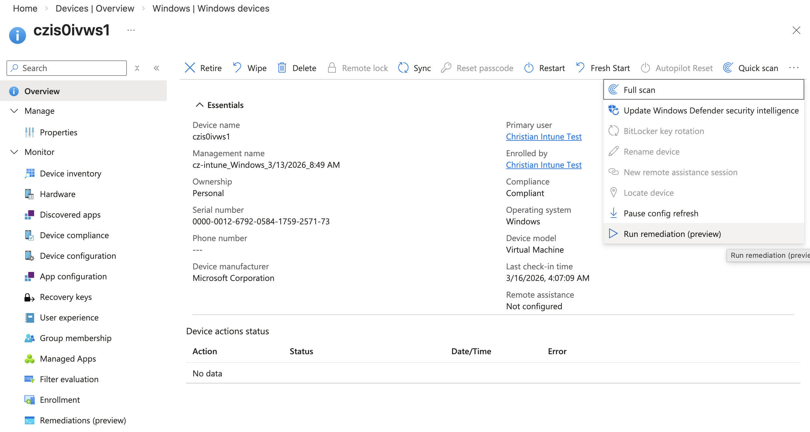

# Azure Intune Prototype

Terraform infrastructure for deploying Windows 11 VMs with intentionally vulnerable software baselines, Azure AD join, Intune MDM enrollment, and Mondoo security scanning.

## Architecture

The infrastructure is split into two layers with independent lifecycles:

```
azure-intune/
├── Makefile                        # Root-level orchestration (full lifecycle)
├── foundation/                     # Persistent layer (deploy once)
│   ├── main.tf                     # Resource group, storage account, Azure AD app
│   ├── outputs.tf
│   ├── providers.tf
│   └── variables.tf
├── testbed/                        # Ephemeral layer (tear down / rebuild freely)
│   ├── main.tf                     # VNet, Windows VMs, RBAC, Mondoo
│   ├── mondoo.tf                   # Optional Mondoo space + registration token
│   ├── outputs.tf                  # Includes Intune enrollment instructions
│   ├── providers.tf
│   ├── variables.tf
│   ├── reinstall-vulnerable-software.sh  # Re-install vuln baseline after remediation
│   ├── run-cnspec-scan.sh                # Trigger cnspec scan on the VM
│   ├── trigger-intune-sync.sh            # Force Intune to re-evaluate remediations
│   ├── docs/
│   │   └── intune-run-remediation.png    # Screenshot: manual trigger from portal
│   ├── environments/
│   │   └── dev/
│   │       └── terraform.tfvars.example
│   └── installers/                 # Binary installers (tracked via Git LFS)
│       ├── 7zip/
│       ├── adobe/
│       ├── chrome/
│       ├── java/
│       ├── zoom/
│       └── scripts/                # PowerShell scripts
│           ├── vm-setup.ps1
│           └── remediation/
│               └── CVE-2024-20726/
└── modules/
    ├── network/                    # VNet, subnet, NSG
    └── windows-vm/                 # Windows VM + AAD join + setup script
        └── scripts/
            └── vm-setup.ps1
```

### Foundation (`foundation/`)

Persistent resources that survive testbed teardowns:

- **Resource Group**: `rg-intune-prototype-foundation-<suffix>`
- **Storage Account**: Blob storage for vulnerable software installers (`vulnerable-apps` container)
- **Azure AD App Registration**: Service principal with Microsoft Graph permissions for Intune API access (device management, configuration, apps, scripts)

### Testbed (`testbed/`)

Ephemeral resources that can be destroyed and rebuilt without affecting the foundation:

- **Resource Group**: `rg-hackathon-intune-<suffix>`
- **Virtual Network**: VNet + subnet + NSG (with optional RDP access)
- **Windows 11 VM**: One workstation (`hackathon-intune-workstation-1`) provisioned with a vulnerable software baseline
- **Mondoo Integration**: Optional space + registration token for vulnerability scanning
- **RBAC**: VM Administrator Login role assignments for Azure AD RDP
- **Entra ID Dynamic Group**: Groups Intune-managed devices for policy targeting

The testbed reads foundation outputs via `terraform_remote_state`.

### Vulnerable Software Baseline

The VM is provisioned with these intentionally outdated applications:

| Software | Version | Notable CVEs |
|---|---|---|
| 7-Zip | 23.01 | CVE-2024-11477 (fixed in 24.07) |
| Google Chrome | 120.0.6099.109 | Multiple CVEs (auto-update disabled via policy) |
| Zoom | 5.16.2 | CVE-2024-24691 (fixed in 5.16.5) |
| Adobe Reader DC | 23.006.20380 | Multiple CVEs |
| AdoptOpenJDK JRE 8 | 8u202 | CVE-2019-2699 (fixed in 8u211) |

## Prerequisites

- [Terraform](https://developer.hashicorp.com/terraform/install) >= 1.5.0
- [Azure CLI](https://learn.microsoft.com/en-us/cli/azure/install-azure-cli) (`az login` authenticated)
- [Git LFS](https://git-lfs.github.com/) (binary installers are tracked via LFS)
- [direnv](https://direnv.net) (optional, for environment variable management)
- Mondoo API token (optional, for vulnerability scanning)

### Terraform State

Both layers use local state files (`terraform.tfstate` in each directory). The testbed reads foundation outputs via a local `terraform_remote_state` reference.

## Quick Start

All commands run from the repository root using the Makefile.

### 1. Initialize

```bash
make init
```

### 2. Deploy Foundation (one-time)

```bash
make deploy-foundation
```

### 3. Upload Installers

The vulnerable software installers are included in `testbed/installers/` (tracked via Git LFS). Upload them to blob storage:

```bash
make upload-installers
```

### 4. Deploy Testbed

```bash
make deploy-testbed
```

This auto-generates a VM admin password and prints it to stdout. To provide your own:

```bash
make deploy-testbed VM_ADMIN_PASSWORD="YourSecurePassword123!"
```

### 5. Full Deploy (both layers)

```bash
make deploy
```

## Makefile Targets

```
make help
```

| Target | Description |
|---|---|
| `help` | Show all targets and variables |
| `init` | Run `terraform init` in both layers |
| `plan` | Run `terraform plan` on both layers |
| `plan-foundation` | Plan foundation only |
| `plan-testbed` | Plan testbed only |
| `deploy` | Deploy everything (foundation then testbed) |
| `deploy-foundation` | Deploy foundation layer only |
| `deploy-testbed` | Deploy testbed layer (auto-generates password if not set) |
| `destroy` | Destroy testbed only (preserves foundation/storage) |
| `destroy-all` | Destroy testbed first, then foundation |
| `status` | Show terraform state for both layers |
| `output` | Show terraform outputs from both layers |
| `upload-installers` | Upload installer files to blob storage |

### Variables

| Variable | Default | Description |
|---|---|---|
| `AUTO_APPROVE` | _(unset)_ | Set to `1` for `-auto-approve` |
| `ENABLE_RDP` | `true` | Enable RDP access (public IPs + port 3389) |
| `VM_ADMIN_PASSWORD` | _(auto-generated)_ | VM admin password (printed to stdout if generated) |
| `MONDOO_ORG_ID` | _(empty)_ | Mondoo organization ID |
| `MONDOO_API_TOKEN` | _(empty)_ | Mondoo API token (skips Mondoo if empty) |
| `INSTALLERS_DIR` | `./testbed/installers` | Local path to installer files |

Examples:

```bash
# Deploy with auto-approve and RDP disabled
make deploy AUTO_APPROVE=1 ENABLE_RDP=false

# Deploy with Mondoo integration
make deploy-testbed MONDOO_ORG_ID=myorg MONDOO_API_TOKEN=eyJ...

# Plan only
make plan

# Destroy testbed, keep foundation
make destroy AUTO_APPROVE=1

# Destroy everything
make destroy-all
```

## Tear Down

### Testbed only (preserves foundation storage and Azure AD app)

```bash
make destroy
```

### Full teardown

```bash
make destroy-all
```

## RDP Access

When `ENABLE_RDP=true`, each VM gets a public IP with port 3389 open. Connect using an Entra ID user **without MFA** (MFA blocks enrollment in RDP sessions). NLA is disabled on the VMs to allow Azure AD login.

**Username format for Entra ID users**: `AzureAD\user@domain.com`

```bash
# Get the VM public IP
cd testbed && terraform output windows_workstation_1_public_ip
```

## Intune MDM Enrollment

### Prerequisites

- An Entra ID user with an **Intune license** assigned
- The user must **NOT** have MFA enforced (MFA blocks enrollment in RDP sessions)
- The user needs the **Virtual Machine Administrator Login** RBAC role on the VM

### Why Manual Enrollment is Required

Without **Azure AD Premium P1/P2**, automatic MDM enrollment is not available:

- The "Mobility (MDM and WIP)" blade in Entra ID shows: _"Automatic MDM enrollment is available only for Microsoft Entra ID Premium subscribers"_
- `deviceenroller /c /AutoEnrollMDM` fails because MDM user scope cannot be configured
- `deviceenroller /c /AutoEnrollMDMUsingAADDeviceCredential` requires an Intune Device license on the device object
- The `AADLoginForWindows` VM extension's `mdmId` parameter also requires Premium

The vm-setup.ps1 script pre-configures the MDM enrollment URLs in the registry so the manual enrollment step works without extra configuration.

### Enrollment Steps

1. RDP to the VM's public IP with the Entra ID user credentials (see [RDP Access](#rdp-access))
2. On the VM, open **Settings > Accounts > Access work or school**
4. Click **Connect** then select **"Enroll only in device management"**
5. Enter the Entra ID user credentials
6. Verify in the [Intune admin center](https://intune.microsoft.com/#view/Microsoft_Intune_DeviceSettings/DevicesMenu/~/mDMDevicesPreview)

> Propagation can take several minutes. The VM may not appear in Intune immediately.

## VM Setup Script (`vm-setup.ps1`)

The setup script runs as a Custom Script Extension on first boot and performs these steps in order:

1. **Waits for Azure AD join** to complete (up to 5 minutes)
2. **Configures MDM enrollment URLs** in the registry under the tenant's CloudDomainJoin key
3. **Installs winget** (Windows Package Manager) with VCLibs and UI.Xaml dependencies
5. **Installs vulnerable software** (7-Zip 23.01) from Azure blob storage
6. **Installs cnspec** (Mondoo agent) with registration, service, and auto-update
7. **Configures RDP** for Azure AD login (disables NLA)
8. **Generates a verification report** at `C:\vulnerable-baseline-report.json`
9. **Cleans up** the config file containing sensitive tokens

### Why winget is Installed

The Azure Marketplace Windows 11 Enterprise image does **not** include winget. Intune remediation scripts depend on winget to detect and upgrade software. Without winget pre-installed:

- Detection scripts fail with "winget is not available on this system"
- Remediation scripts cannot run `winget upgrade`

The setup script installs winget as a provisioned package (available to all users) and adds it to the system PATH.

> **Important**: winget does not work when running as SYSTEM (exit code `-1073741515` / `STATUS_DLL_NOT_FOUND`). It requires a user context. This is fine for Intune remediation scripts, which run in user context, but means `az vm run-command invoke` (which runs as SYSTEM) cannot use winget directly.

## Intune Detection and Remediation

### How It Works

Intune uses **remediation scripts** (HealthScripts) to detect and fix configuration drift:

1. **Detection script** runs periodically and checks if 7-Zip needs updating:
   ```powershell
   winget list --id 7zip.7zip --upgrade-available --accept-source-agreements
   ```
   - Exit code `0` + output = upgrade available → script exits `1` (non-compliant)
   - Exit code non-zero = up to date → script exits `0` (compliant)

2. **Remediation script** runs when detection reports non-compliant:
   ```powershell
   winget upgrade --id 7zip.7zip --silent --accept-package-agreements --accept-source-agreements
   ```

### Key Findings

- **winget automatically recognizes manually installed software**: 7-Zip installed via the EXE installer from blob storage is detected by winget as `7zip.7zip` version `23.01` with source `winget`. No additional "adoption" step is needed.
- **Upgrade detection works**: `winget list --id 7zip.7zip --upgrade-available` correctly identifies that version `26.00` is available as an upgrade from `23.01`.
- **Scripts run in user context**: Intune remediation scripts have `RunAsAccount: 1` (user context), which is required because winget does not work as SYSTEM.
- **Scripts are cached locally**: Intune stores remediation scripts at `C:\Windows\IMECache\HealthScripts\{policyId}_1\detect.ps1` and `remediate.ps1`. This directory is access-restricted and cannot be read by normal user processes.

## Helper Scripts

### Re-install Vulnerable Software

After Intune remediates the VM (upgrades 7-Zip to 26.00), use this script to reset to the vulnerable baseline for re-testing:

```bash
cd testbed
./reinstall-vulnerable-software.sh
```

This downloads 7-Zip 23.01 from blob storage and reinstalls it silently via `az vm run-command`.

### Run cnspec Scan

Trigger an on-demand cnspec vulnerability scan on the VM:

```bash
cd testbed
./run-cnspec-scan.sh
```

### Trigger Intune Sync

Force Intune to re-evaluate remediation scripts on the VM (restarts the Intune Management Extension service and triggers the MDM PushLaunch task):

```bash
cd testbed
./trigger-intune-sync.sh
```

Alternatively, you can trigger a specific remediation from the Intune admin center:
**Devices > Windows > select device > "..." > "Run remediation (preview)"**



## Known Limitations

- **Azure AD Premium required for auto-enrollment**: Without P1/P2, Intune MDM enrollment requires a manual step via the Settings UI. The scheduled task approach (`deviceenroller /c /AutoEnrollMDM`) does not work because MDM user scope cannot be configured in Entra ID without Premium.
- **MFA blocks RDP enrollment**: Users with mandatory MFA cannot complete Intune enrollment through an RDP session. The MFA prompt does not render properly. Use a dedicated test user without MFA.
- **winget requires user context**: winget cannot run as SYSTEM. Any automation that needs winget must run in a user session (Intune remediation scripts handle this correctly).
