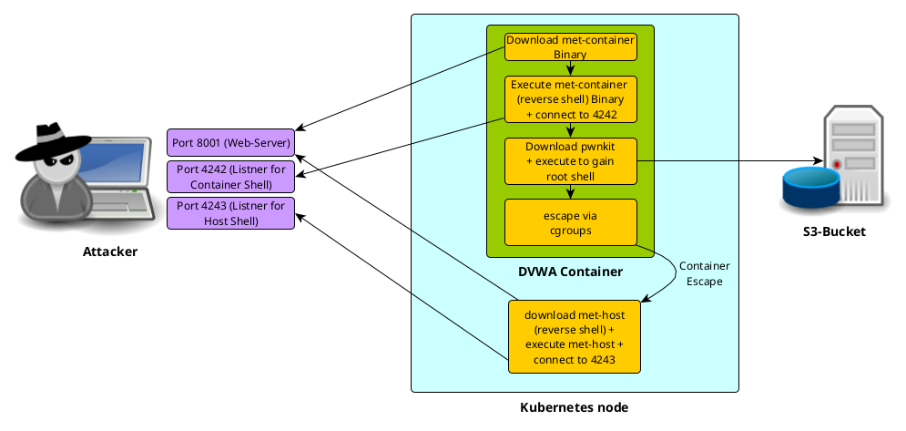

# Demonstrating Container Escape in Kubernetes

This houses demonstration scenarios showcasing container escapes in Kubernetes environments, particularly in AKS (Azure Kubernetes Service) and EKS (Amazon Elastic Kubernetes Service). These scenarios can serve as engaging demonstrations using Mondoo.

Each folder listed below contains a specific demo setup. Navigate to the corresponding README files within these folders for detailed instructions on executing each demonstration:

- [aws](./aks): Contains a Terraform template for deploying an EKS Kubernetes cluster on AWS, along with a DVWA (Damn Vulnerable Web Application) container escape demo.
- [azure](./azure/): Holds a Terraform template for deploying an AKS Kubernetes cluster on Azure, coupled with a DVWA container escape demo.
- [gcp](./gcp): Offers a Terraform template for deploying a GKE (Google Kubernetes Engine) cluster on GCP, including a DVWA container escape demo.
- [minikube](./minikube/): Presents a Terraform template for setting up a Minikube cluster with a DVWA container escape demo.

The hacking demonstrations in AKS, EKS, and GKE follow the procedure below:

1. Exploit the web application through a command injection vulnerability.
2. Perform a privilege escalation to obtain root rights within the container.
3. Execute a container escape to gain a root shell on the container host.

By following these steps, you can observe how potential security breaches occur and take steps to safeguard your own Kubernetes environments.

## Contributors + Kudos

- Scott Ford [scottford-io](https://github.com/scottford-io)
- Yvo Vandoorn [yvovandoorn](https://github.com/yvovandoorn)
- Dominik Richter [arlimus](https://github.com/arlimus)
- Christoph Hartmann [chris-rock](https://github.com/chris-rock)
- Patrick Münch [atomic111](https://github.com/atomic111)
- Manuel Weber [mm-weber](https://github.com/mm-weber)

Thanks to all of you!!

## Disclaimer

This or previous program is for Educational purpose ONLY. Do not use it without permission. The usual disclaimer applies, especially the fact that we (Mondoo Inc) is not liable for any damages caused by direct or indirect use of the information or functionality provided by these programs. The author or any Internet provider bears NO responsibility for content or misuse of these programs or any derivatives thereof. By using these programs you accept the fact that any damage (dataloss, system crash, system compromise, etc.) caused by the use of these programs is not Mondoo Inc's responsibility.
