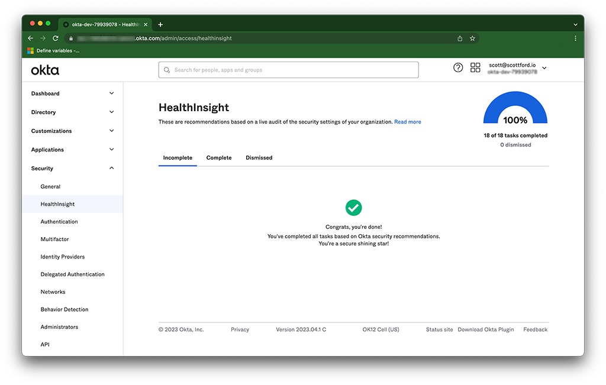

# Okta Provisioning

This repository contains example HashiCorp Terraform code for provisioning an Okta organization.

### Prerequisites

To use try the code in this repository, you will need the following:

- [cnspec](https://github.com/mondoohq/cnspec) - Open source, cloud-native security scanning and policy as code project
- [Terraform](https://terraform.io) -  Infrastructure automation for provisioning
- [Okta Developer account](https://developer.okta.com) - While the Terraform code here *can* be used for configuring production Okta environments, it is **highly recommended** to familiar yourself with how the code works using an Okta Developer account first.

## Setup Okta Dev Account

If you do not already have an Okta development environment, sign-up for a free account at [developer.okta.com](https://developer.okta.com).

### Okta HealthInsights



Okta HealthInsights provides recommended security tasks to improve security for an Okta org. The Terraform code in this repository configures all of the [recommended tasks and recommendations](https://help.okta.com/en-us/Content/Topics/Security/healthinsight/healthinsight-security-task-recomendations.htm).

### Create an Okta API token

To manage Okta with Terraform and scan Okta with cnspec, you will need an Okta API token. Visit [Create an API token](https://developer.okta.com/docs/guides/create-an-api-token/main/) to learn how to create an API token.

## Fork and clone this repository

If you want to try this code, first thing you should do is fork it, then clone it locally.

### Configure Okta Provider for Terraform

Okta builds and maintains the [Terraform Provider for Okta](https://registry.terraform.io/providers/okta/okta/latest/docs) to manage Okta Organizations using infrastructure as code. To configure the provider, create a `terraform.tfvars` file with the following values:

```bash
api_token = "<YOUR_TOKE>"

org_name = "<YOUR_ORG>"

base_url = "<YOUR_BASE_URL>"

```

### About Terraform Backend

This repository is configured to use my own GCP GCS bucket for the Terraform backend to store the state file. If you are unfamiliar with how to setup a Terraform backend, see [Backend Configuration](https://developer.hashicorp.com/terraform/language/settings/backends/configuration) on the Terraform site. If you are still stuck, reach out to me...I am a pretty nice guy (most of the time) and would be happy to help! 🙌🏻

### Terraform Init

Once the backend is configured, cd into the `terraform` directory in this repo and run `terraform init` to download the modules and initialize the backend.

### Security scan Terraform HCL with cnspec (pre-plan)

Run the following command from the root directory of this repository to scan the Terraform code in this repository before you apply any changes to your Okta environment:

```typescript
cnspec scan terraform ./terraform -f policies/okta-security.mql.yaml
```

### Security scan Terraform Plan with cnspec (post-plan)

The policy in this repository also supports scanning of Terraform plan files which provides a deeper level of understanding of the configuration changes to be applied.

#### Generate a Terraform plan.json to scan

```bash
cd terraform
terraform plan -out tfplan
terraform show -json tfplan > tfplan.json
```

#### Scan the Terraform tfplan.json

```typescript
cnspec scan terraform plan tfplan.json -f policies/okta-security.mql.yaml
```
